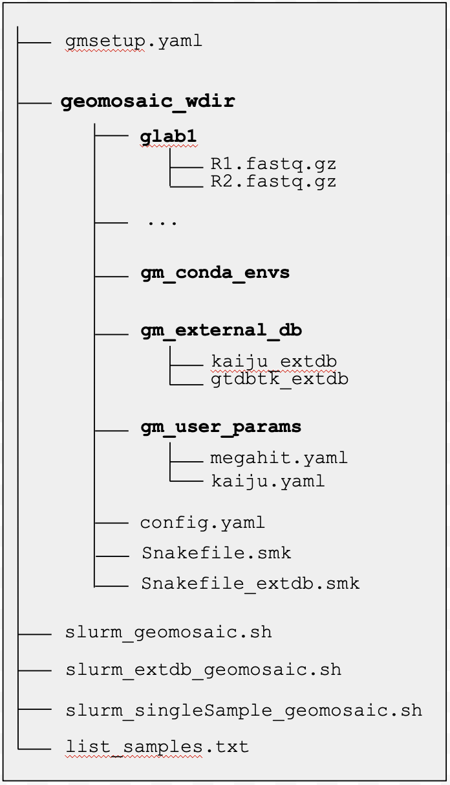
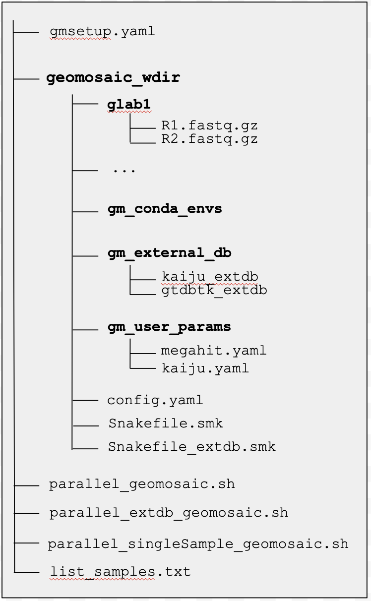

## `geomosaic prerun`
{: .no_toc }

<br>

<details open markdown="block">
  <summary>
    Table of contents
  </summary>
  {: .text-delta }
- TOC
{:toc}
</details>

-----

### Overview


This command is very easy. It is useful to install the required conda environments to run your workflow/unit.

```
geomosaic prerun --help
```

```
usage: geomosaic prerun -s SETUP_FILE --exec_type {slurm,gnu_parallel} [-u] [-t THREADS] [-f FOLDER_LOGS] [-l LIST_SAMPLE_OUTPUT] [-o OUTPUT_SCRIPT]
                        [-e EXTDB_OUTPUT_SCRIPT] [--noscript] [--ignore_samples IGNORE_SAMPLES] [-m MEMORY] [-p PARTITION]
                        [--mail_type {NONE,BEGIN,END,FAIL,REQUEUE,ALL}] [--mail_user MAIL_USER] [-n N_JOBS] [-h]

DESCRIPTION: This command is usefull to install the required conda environments of your workflow/unit and create required scripts to execute Geomosaic on a cluster using SLURM

Required Arguments:
  -s SETUP_FILE, --setup_file SETUP_FILE
                        Geomosaic setup file created from the geomosaic setup ... command.
  --exec_type {slurm,gnu_parallel}
                        Use this option to specify how do you want execute geomosaic. If SLURM is available on your cluster we suggest to use '--exec_type
                        slurm'. If not, you can use '--exec_type gnu_parallel'. More details on the Geomosaic Documentation.

Optional Arguments for BOTH SLURM and GNU PARALLEL:
  -u, --unit            Install the conda environment of your geomosaic unit.
  -t THREADS, --threads THREADS
                        Threads to use (per sample). This value will override the one specified in the workflow/unit (config file) and thus will replace
                        threads value in the config file. Default is None, means that is not going to be replace (Available for '--exec_type slurm' or '--
                        exec_type gnu_parallel')
  -f FOLDER_LOGS, --folder_logs FOLDER_LOGS
                        Folder for logs files. Default value is None means that slurm logs are saved in your current directory. However we suggest you to
                        specify it and if it does not exists, Geomosaic will create it. (Available for '--exec_type slurm' or '--exec_type gnu_parallel')
  -l LIST_SAMPLE_OUTPUT, --list_sample_output LIST_SAMPLE_OUTPUT
                        Filename where to write the list of samples. Default: list_samples.txt created in the current directory. (Available for '--exec_type
                        slurm' or '--exec_type gnu_parallel')
  -o OUTPUT_SCRIPT, --output_script OUTPUT_SCRIPT
                        Filename for the SLURM or GNU Parallel script. As default it will be created as slurm_geomosaic.sh or parallel_geomosaic in the
                        current directory (depending on the '--exec_type' option). (Available for '--exec_type slurm' or '--exec_type gnu_parallel')
  -e EXTDB_OUTPUT_SCRIPT, --extdb_output_script EXTDB_OUTPUT_SCRIPT
                        Filename for the SLURM or GNU Parallel script to execute external db setup. As default it will be created as
                        slurm_extdb_geomosaic.sh or parallel_extdb_geomosaic.sh in the current directory (depending on the '--exec_type' option). (Available
                        for '--exec_type slurm' or '--exec_type gnu_parallel')
  --noscript            Avoid creating scripts for SLURM or GNU Parallel. This option is useful if you have already created those scripts
  --ignore_samples IGNORE_SAMPLES
                        a comma separated list of Samples to ignore (no spaces). Example: --packages sample1,sample2 .

Optional Arguments ONLY for SLURM Specification:
  -m MEMORY, --memory MEMORY
                        Memory specification (in GB) for slurm job. (requires '--exec_type slurm' option)
  -p PARTITION, --partition PARTITION
                        Partition specification for slurm job in the cluster. (requires '--exec_type slurm' option)
  --mail_type {NONE,BEGIN,END,FAIL,REQUEUE,ALL}
                        Mail type to notify user about occurred even type in slurm. Ignore this option if you are not interested to get(requires '--
                        exec_type slurm' option)
  --mail_user MAIL_USER
                        Email where to to receive slurm notification type specified in '--mail_type'. (requires '--exec_type slurm' option)

Optional Arguments for GNU Parallel:
  -n N_JOBS, --n_jobs N_JOBS
                        Number of jobs to execute in parallel using GNU Parallel. More details on the Geomosaic Documentation. (requires '--exec_type
                        gnu_parallel' option).

Help Arguments:
  -h, --help            show this help message and exit

```

### Arguments

This command has both required and optional arguments. But as you can see it is very simple.

- __REQUIRED__
    - (`-s`) Specifiy the name of the Geomosaic config file, obtained with the `setup` command.
        - **IMPORTANT**: the file specified here should contain the path of the `gm_conda_envs`, so if in this path the conda environments were already installed, geomosaic (and in particular snakemake) can recognize them and avoid multiple installations.

    - (`--exec_type`) Use this option to specify how do you want execute Geomosaic. If SLURM is available on your cluster we suggest to use `--exec_type slurm`, otherwise GNU Parallel will be used (`--exec_type gnu_parallel`). 
        - If you want to use Geomosaic on your personal computer GNU Parallel can be a good option. In this case, you should set the number of jobs to execute in parallel taking into account the number of cpus that you can use. For instance, if 36 cores are available you may want to set `n_jobs_in_parallel=4` and `threads_per_job=9` in script created from `geomosaic prerun ...`. This allows you to perform the Geomosaic pipeline for 4 samples in parallel at the same time, using 9 cpus for each of them. 
        
        __However__, it is important to note that, while SLURM has an internal handles of resources such as Memory (RAM), Time or CPUs, GNU Parallel (to our knowledge) cannot perform this type of management, so __make sure__ that your available memory is enough to execute your modules, for the chosen number of samples at the same time.

        - **IMPORTANT**: make sure that if you are going to use `--exec_type` you also specify at least the options `-m`and `-p` (if they are required from your cluster).

- __OPTIONAL Arguments for BOTH SLURM and GNU PARALLEL__
    - (`-u`) This option is necessary if you want to install the conda environment required to run your unit.
    - (`-t`) If specified this value will override the one specified in the workflow/unit (config file) and thus will replace threads value in the config file. (Available for '--exec_type slurm' or '--exec_type gnu_parallel')
    - (`-f`) Here you can specify a folder for logs files. Default is None, but we suggest you to specify it and if it does not exists, Geomosaic will create it. (Available for '--exec_type slurm' or '--exec_type gnu_parallel')
    - (`-l`) Filename where to write the list of samples. Default: list_samples.txt created in the current directory. (Available for '--exec_type slurm' or '--exec_type gnu_parallel')
    - (`-o`) Filename for the SLURM or GNU Parallel script. Default: slurm_geomosaic.sh or parallel_geomosaic.sh created in the current directory. (Available for '--exec_type slurm' or '--exec_type gnu_parallel')
    - (`-e`) Filename for the SLURM or GNU Parallel script to execute external db setup. Default: slurm_extdb_geomosaic.sh or parallel_extdb_geomosaic.sh created in the current directory. (Available for '--exec_type slurm' or '--exec_type gnu_parallel')
    - (`--noscript`) Avoid creating scripts for SLURM or GNU Parallel. This option is useful if you have already created those scripts
    - (`--ignore_samples <IGNORE_SAMPLES>`) a comma separated list of Samples to ignore (no spaces). This option is useful for example when no assembly was succefully retrieved. By providing these samples as comma separated (with no spaces) geomosaic will create the next slurm script and the list of samples ignoring the ones that are provided in this option
- __OPTIONAL FOR SLURM EXECUTION__
    - (`-m`) Memory specification in GB for slurm job sbatch specification. (requires '--exec_type slurm' option)
    - (`-p`) Partition specification for slurm job in the cluster. (requires '--exec_type slurm' option). Some HPC managements require to run certain jobs or parallel jobs in specific partitions. With this option you can specify it.
    - (`--mail_type`) use this flag to specify the mail type for slurm event. Available values: NONE,BEGIN,END,FAIL,REQUEUE,ALL (requires '--exec_type slurm' option)
    - (`--mail_user`) Here you can specify your email of interest where to receive slurm notification type specified in '--mail_type'. (requires '--exec_type slurm' option)
- __OPTIONAL FOR GNU PARALLEL EXECUTION__
    - (`-n`) Number of jobs to execute in parallel using GNU Parallel. (requires '--exec_type gnu_parallel' option)
    

These options allow you to create a minimal draft for slurm scripts. However, it is strongly recommended to see the [Slurm Documentation](https://slurm.schedmd.com/documentation.html).


### Example usage `geomosaic prerun` [SLURM Available]
```
geomosaic prerun -s gmsetup_exp2023.yaml --exec_type slurm -t 30 -m 250 -p test -f slurm_logs
```

```

Geomosaic Process: Geomosaic will overwite the 'threads' value in the config file since it is idifferent.

Geomosaic Note: The following draft scripts for slurm execution were created (along with file containing the samples list):
	- /geomosaic_test/slurm_geomosaic.sh
	- /geomosaic_test/slurm_extdb_geomosaic.sh
	- /geomosaic_test/slurm_singleSample_geomosaic.sh
	- /geomosaic_test/list_samples.txt

These script can be considered minimal for SLURM. If you need you can modify them to add more SBATCH information.
More details can be retrieved to official SLURM Documentation.

Geomosaic Note: So now you are ready to go!

STEP 1): setup the required databases of your pipeline, by executing:
	$ sbatch /geomosaic_test/slurm_extdb_geomosaic.sh

STEP 2): once it is finished, you can execute the real pipeline:
	$ sbatch /geomosaic_test/slurm_geomosaic.sh

EVENTUALLY): if you need to execute your workflow/unit just for one sample you can execute the following script through sbatch (specifying your sample name of interest):
	$ sbatch /geomosaic_test/slurm_simpleSample_geomosaic.sh MYSAMPLE

Geomosaic Process: Installing all the conda environments of your workflow/unit. This may take a while...
Building DAG of jobs...

--> OK <--

```

#### What to expect after `geomosaic prerun` for SLURM
If you have executed this command in the same folder where `gmsetup.yaml` is located, you should see in the same directory the following files:

- `/geomosaic_test/slurm_geomosaic.sh`
- `/geomosaic_test/slurm_extdb_geomosaic.sh`
- `/geomosaic_test/slurm_singleSample_geomosaic.sh`
- `/geomosaic_test/list_samples.txt`





### Example usage `geomosaic prerun` [GNU Parallel Available]
```
geomosaic prerun -s gmsetup_exp2023.yaml --unit --exec_type gnu_parallel -t 9 -n 4 -f gnuparallel_logs
```

```

Geomosaic Note: The following draft scripts for GNU Parallel execution were created (along with file containing the samples list):
	- /geomosaic_test/parallel_geomosaic.sh
	- /geomosaic_test/parallel_extdb_geomosaic.sh
	- /geomosaic_test/parallel_singleSample_geomosaic.sh
	- /geomosaic_test/list_samples.txt

These script can be considered minimal for GNU Parallel. Feel free to modify them to add more complex codes.
More details can be retrieved to official GNU Parallel Documentation.

Geomosaic Note: Since your using GNU Parallel, you should set the number of jobs to execute in parallel taking into account the number of cpus that you can use.
For instance, if 36 cores are available you can open the following file
/geomosaic_test/parallel_geomosaic.sh

and modify the following variables
n_jobs_in_parallel=4
threads_per_job=9.

Geomosaic Note: So now you are ready to go!

STEP 1): setup the required databases of your pipeline, by executing:
	$ bash /geomosaic_test/parallel_extdb_geomosaic.sh

STEP 2): once it is finished, you can execute the real pipeline:
	$ bash /geomosaic_test/parallel_geomosaic.sh

EVENTUALLY): if you need to execute your workflow/unit just for one sample you can execute the following script through bash (specifying your sample name of interest):
	$ bash /geomosaic_test/parallel_singleSample_geomosaic.sh MYSAMPLE

Geomosaic Process: Installing all the conda environments of your workflow/unit. This may take a while...
Building DAG of jobs...

--> OK <--

```

#### What to expect after `geomosaic prerun` for GNU PARALLEL {-}
The following script are created the same folder of the `gmsetup.yaml`:

- `/geomosaic_test/parallel_geomosaic.sh`
- `/geomosaic_test/parallel_extdb_geomosaic.sh`
- `/geomosaic_test/parallel_singleSample_geomosaic.sh`
- `/geomosaic_test/list_samples.txt`




