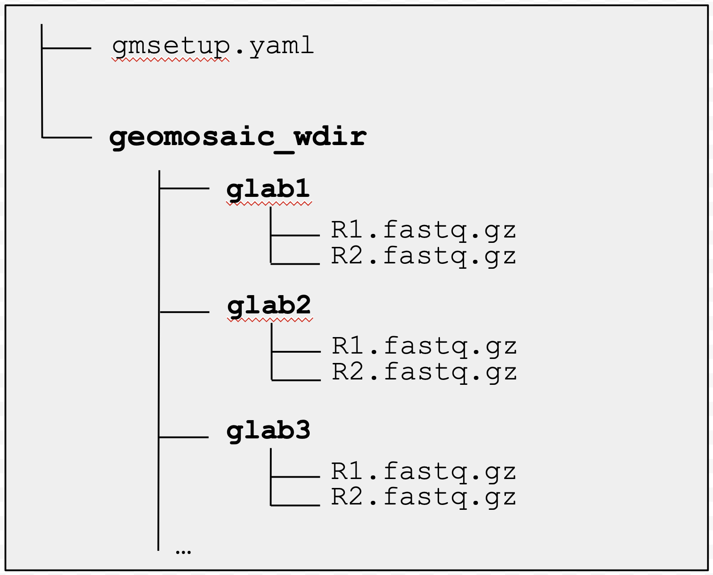

## `geomosaic setup`
{: .no_toc }

<br>

<details open markdown="block">
  <summary>
    Table of contents
  </summary>
  {: .text-delta }
- TOC
{:toc}
</details>

-----

### Overview

This commands should be the first one to be executed as it sets up the Geomosaic working directory with the corresponding folder and sample names.

```
geomosaic setup --help
```

```
usage: geomosaic setup -d DIRECTORY -t SAMPLE_TABLE [-s SETUP_FILE] [-c CONDAENV_GMFOLDER] [-e EXTERNALDB_GMFOLDER] [-f {tsv,csv,excel}] [-w WORKING_DIR]
                       [-n PROJECT_NAME] [--move_and_rename] [--skip_checks] [-h]

DESCRIPTION: It creates the geomosaic working directory and the relative samples folders based on the provided sample table

Required Arguments:
  -d DIRECTORY, --directory DIRECTORY
                        Path to the directory containing raw reads (fastq.gz files) (default: None)
  -t SAMPLE_TABLE, --sample_table SAMPLE_TABLE
                        Path to the user sample table (default: None)

Optional Arguments:
  -s SETUP_FILE, --setup_file SETUP_FILE
                        Output name for the geomosaic setup file (yaml extension). This file is necessary for the < geomosaic workflow > command. (default:
                        gmsetup.yaml)
  -c CONDAENV_GMFOLDER, --condaenv_gmfolder CONDAENV_GMFOLDER
                        This option allows to provide a path folder in which geomosaic is going to install all the conda environments of your workflow. This
                        option is very useful if you want to execute Geomosaic for different set of reads, as here you can provide the same folder and
                        prevent multiple installation of the same conda environments. (default: None)
  -e EXTERNALDB_GMFOLDER, --externaldb_gmfolder EXTERNALDB_GMFOLDER
                        This option allows to provide a path folder in which geomosaic is going to download all the external databases used by the packages
                        of your workflow. This option is very useful if you want to execute Geomosaic for different set of reads, as here you can provide
                        the same folder and prevent multiple donwload of the same external databases. (default: None)
  -f {tsv,csv,excel}, --format_table {tsv,csv,excel}
                        Format of the provided table. Allowed: tsv, csv, excel (default: tsv)
  -w WORKING_DIR, --working_dir WORKING_DIR
                        The Geomosaic working directory to create for its execution. Default: 'geomosaic' folder created in the current directory (default:
                        geomosaic)
  -n PROJECT_NAME, --project_name PROJECT_NAME
                        Name of the project. The first 8 Characters will be used for SLURM job name (default: Geomosaic_Workflow)
  --move_and_rename     Suggested flag if the provided raw reads directory is an already backup of the original files. In this case, geomosaic will create
                        only symbolic link of raw reads to its working directory. Note: This flag cannot be used if there are multiple files for each R1 and
                        R2 sample reads, as geomosaic will 'cat' them to a single file. (default: False)
  --skip_checks         If you are sure that every file is in its correct location and the sample names are filled correcyly, you can skip checks with this
                        flags. However we do not suggest to use it. (default: False)

Help Arguments:
  -h, --help            show this help message and exit

```

### Arguments

`setup` command has two required arguments:
- __REQUIRED__
    - (`-t`) the __sample table__ including all names of the reads files and the desired sample names. It is expected to provide a table with three columns having the following headers: `r1`, `r2`, `sample`. For instance:

        | r1 | r2 | sample |
        | ---- | ----| ----|
        | S1_L001_R1_fastq.gz |  S1_L001_R2_fastq.gz | sample1|
        | S1_L002_R1_fastq.gz |  S1_L002_R2_fastq.gz | sample1|
        | S2_L001_R1_fastq.gz |  S2_L001_R2_fastq.gz | sample2|
        | S2_L002_R1_fastq.gz |  S2_L002_R2_fastq.gz | sample2|
        | S3_L001_R1_fastq.gz |  S3_L001_R2_fastq.gz | sample3|
        | ... |  ... | ... |

        __`NOTE 1: Sample and reads name with no spaces`__: the values on the `sample` column (but also on the `r1` and `r2` columns) should __*not*__ present any space as it increases the folder organization complexity. However, Geomosaic will perform a check (assertion) and possibly print an Error message describing the line that containes the space.

        __`NOTE 2: Different lines with the same sample name are allowed`__: sequencing data are often splitted for a single sample. In this case, is it quite common to `cat` them all in one file; this is performed for both R1 (read R1) and R2 (read R2). Geomosaic allows the same sample name in multiple lines of the provided table, as it will `cat` all the reads R1 in one file R1 and all the reads R2 in one file R2. This case is also presented in the example table above (line 2,3 and 3, 4).

        In the `NOTE 2 scenario`, Geomosaic will perform a `group by` of R1 and R2 files based on the `sample` column to then use the `cat` command. For instance, by performing a group by on the provided example table, the following files are obtained:

        >| r1 | r2 | sample |
        >| ---- | ----| ----|
        >| [S1_L001_R1.fastq.gz, S1_L002_R1.fastq.gz] |  [S1_L001_R2.fastq.gz, S1_L002_R2.fastq.gz] | sample1|
        >| [S2_L001_R1.fastq.gz, S2_L002_R1.fastq.gz] |  [S2_L001_R2.fastq.gz, S2_L002_R2.fastq.gz] | sample2|
        >| [S3_L001_R1.fastq.gz, ... ]|  [S3_L001_R2.fastq.gz, ...] | sample3|
        >| ... |  ... | ... |


    - (`-d`) the __directory__ containing all raw reads. The name of the listed files has to match the ones provided in the tabular table.


The `setup` command has various optional arguments:
- __OPTIONAL__
    - (`-s`) The output name for the setup file of Geomosaic. Default: `gmsetup.yaml` (in the current directory).
    - (`-c`) This option is very useful if you are going to run geomosaic for different set of raw reads. By specifying this folder, geomosaic will not reinstall all the conda environments. Here you can provide the same folder and prevent multiple installation of the same conda environments. If not specified geomosaic will create a folder called `gm_conda_envs` inside the directory provided by the `-w` option.
    - (`-e`) Similarly to the `-c` parameter, this option is very useful if you are going to run geomosaic for different set of raw reads. By specifying this folder, geomosaic can use already downloaded external databases. If not specified geomosaic will create a folder called `gm_external_db` inside the directory provided by the `-w` option.
        - For example, let's assume that in the following path `/mnt/storage/geomosaic_extdb` are already presents the following databases `kaiju_extdb`, `kraken2_extdb` and `checkm_extdb` (that were downloaded with Geomosaic) are already present; you can use this option as `-e /mnt/storage/geomosaic_extdb` . 
    - (`-f`) With this option you can specify the format separated value of the table provided with the flag `-t`.
    - (`-w`) The Geomosaic working directory to create for its execution. Default: `geomosaic` folder created in the current directory.
    - (`-n`) A project name can be specified with this parameter. It is recommended to use a name without any space.
    - (`--move_and_rename`) You can use this option to directly move the reads file from the directory specified in `-d` parameter instead of creating another copy.

        __`NOTE 3: --move_and_rename parameter not allowed in NOTE 2 scenario`__: due to the need to `cat` all sample sequencing reads in one file, the `--move_and_rename` parameter is not allowed in the `NOTE 2` scenario. Indeed, `--move_and_rename` parameter can be used when there is a single file for both R1 and R2 sequencing reads.

### What to expect from this command
After completing this command you should see:
- a geomosaic setup file, by default called `gmsetup.yaml` that contains some essential information for the next commands. Do not modify this file.
- and the working directory for geomosaic (eventually provided with the option `-w`) which stores a directory for each of the user unique samples. Each sample folder contains containing two files: 
    - `R1.fastq.gz`
    - `R2.fastq.gz`



### Example usage `geomosaic setup`
Assuming my sequencing reads are in the folder termed `sequencing_mg_expedition2023` and my tabular file is called `sample_table_expedition2023.tsv`,
the `setup` command can be executed as follows

```
geomosaic setup -d sequencing_mg_expedition2023 -t sample_table_expedition2023.tsv
```

or providing optional parameters to add further information
```
geomosaic setup -d sequencing_mg_expedition2023 \
                -t sample_table_expedition2023.tsv \
                -s gmsetup_exp2023.yaml \
                -w ./geomosaic_exp2023 \
                -n "Geomosaic EXP2023" \
                --move_and_rename
```

