# Integration example 2: Package with External Database
{: .no_toc }

<br>

<details open markdown="block">
  <summary>
    Table of contents
  </summary>
  {: .text-delta }
- TOC
{:toc}
</details>

-----

This tutorial will guide you through an integration of an example package, that requires an **external database** and it is **not referred to MAGs module**.

## What we need for this integration
- Understand the Stream-level: in this case `Assembly-based`
- Module name: `assembly_func_annotation`
- Package name: `kofam_scan`
- Know which are the conda dependencies for this packages, or the conda package name.
- Know the code to actual integrate and execute the package.

## Step 1: Clone/fork the repository and install Geomosaic

Since the final strategy is to make a pull request to the main repository, we suggest to fork our repo and then clone it (in the SSH way)
```
git@github.com:<YOURNAME>/Geomosaic.git
```
Install the Geomosaic conda environment. You can follow the [Installation Guide](../introduction).

Remember to replace `<YOURNAME>` with your GitHub user account.

Once you have cloned the repository, open the directory created with the clone and also create another branch specifying the name of the package that you are going to integrate

```
git checkout -b kofam_scan
```


## Step 2: Create the module folder (if does not exists)
In this example we are going to integrate a package that perform a functional annotation on Assembly-based starting from the predicted orf (as input). Therefore in this case, the module folder already exists, and we don't need to do anything on this step.

## Step 3: Create the package folder

We need to create the package folder inside the corresponding module, which in this case is `assembly_func_annotation`. Since we are going to integrate the program called `KOfam Scan`, we can create a folder called `kofam_scan`.

{: .highlight }
> {: .warning }
> __Do not__ use any special characters or insert spaces in the name.
>
> Just rely on _underscore_ and all lower-case characters


## Step 4: Create package's snakefiles

Now we need to create the three files where we are going to implement all the necessary code:
- `Snakefile.smk`
- `Snakefile_target.smk`
- `param.yaml`

For now you can leave them empty.

{: .important }
The names for this file are standard and are the same for each package. Do not change the filenames.

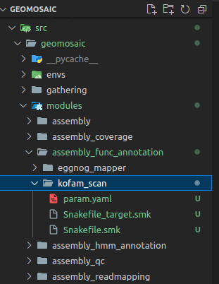

## Step 5: create the corresponding `conda` env file 
In this section we need to create the corresponding `conda` env file describing the necessary dependencies for our package. For this purpose, in the `envs` folder we create a file with the same name of the package (`kofam_scan`) (with the yaml extension). As content of the file we are going to write the necessary dependencies. In this case we are going to specify only `KOfam Scan` from the bioconda channel. The name of the conda environment is the name of the package with `geomosaic_` as prefix.

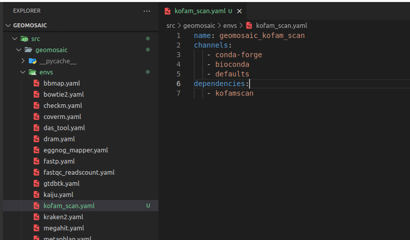

Now we can write our code inside the Snakefile

## Step 6: Link the module/package to the Geomosaic core

So in this section we need to link our new module and/or our new package to the already existing core of Geomosaic, which is represented by the file called `gmpackages.json`. 
Let's see how to do it.

### Step 6.1: `order` section

We can skip the `order` section, since our module `assembly_func_annotation` already existed before this integration.

### Step 6.2: `graph` section

Similarly, we can skip also this section since our module `assembly_func_annotation` already existed before this integration.
 
{: .important }
> If you want to understand what really means a dependency in Geomosaic, you can read this [section]()

### Step 6.3: `modules` section

In the corresponding `modules` section, we need to add the name of our package in our `choices`, which is a dictionary containing all the packages belonging to that module. 
<br>

In particolar, the **key** (the blu string in the image) is the string that will come out in the terminal as a choice, during the workflow decision, while the **value** (in orange) is the actual name of the package, the one that we used also to create the folder in step 3. 
    
{: .important }
Package name on the **value** must match with the folder created in the step 3

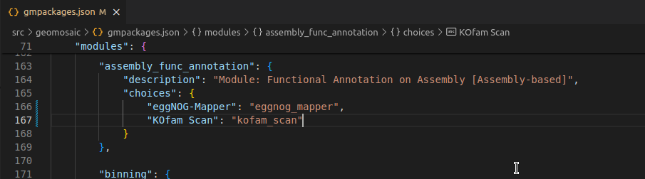

If the package does require any additional input, you can integrate this input in the corresponding section of `additional_input`. In this case we don't need to put any additional argument. 

{: .highlight }
Read [here]() about what are additional arguments

### Step 6.4: `envs` section
This section is very simple, we only need to add the conda env file for our package that we have created in the [Step 5](#step-5-create-the-corresponding-conda-env-file). This filename must have the same package name. In this case `kofam_scan`. 

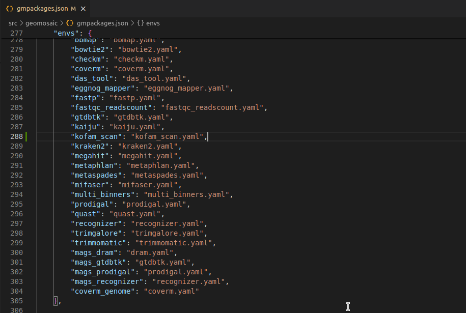

### Step 6.5: `external_db` section
{: .note }
Still under optimization

This section is useful to organize external databases for the package that we are going to integrate. In this example, we need an external database (extdb).

In this section:
- each package that requires an extdb has a key which contains two other keys:
  - `inpfolder`: its value should be the name of the package
  - `outfolder`: must be the name of the folder in which the external databases is going to be downloaded. The pattern is: the name of the package followed by the `_extdb` suffix. However, different package name maybe relay on the same external database as it is for the `recognizer` package and `mags_recognizer`, therefore in such case we specify the same `outfolder`.

So in this section we are going to write as follows:
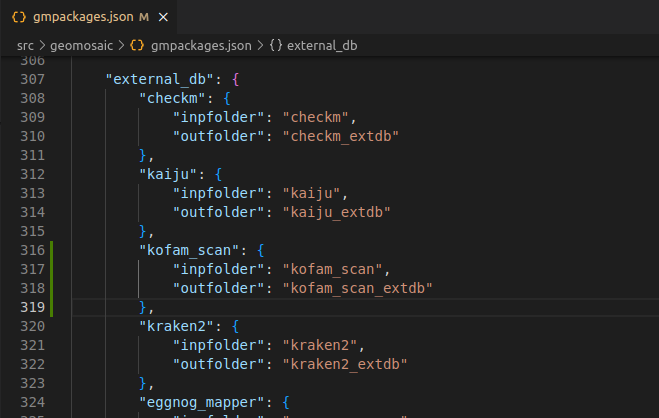

### Step 6.6: `gathering` section
This section is not mandatory. However it is useful if we want to compose some master tables or plots from the results of our package from all the samples computation. In this case, we are not interest in this section. However we could create a script that creates a table of all the reads count for each sample.

At the time of writing, this is the last section in the `gmpackages.json`.

## Step 7: How to organize the code for the External Database (extdb).

### Step 7.1: Create a folder for our package
First we need to create a folder for our package inside the folder called `modules_extdb`. The folder must have the same name of our package; in this case `kofam_scan`. 

### Step 7.2: Creation of code files

In this folder, we create two files named:
- `snakefile.smk`
- `target.txt` 

{: .important }
Do not change this filenames.

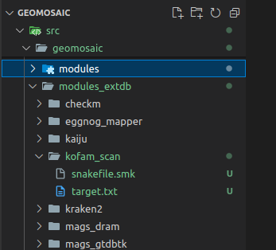

### Step 7.3: Snakefile for extdb
The rule name in the `snakefile.smk` should be the name of the package with the `_db` suffix. In this file we are going to write all the code that we need to setup the external database for this package. 
- The output folder is the name of the package with the `_extdb_folder` suffix. 

THe integration for the code of the extdb should be something like this

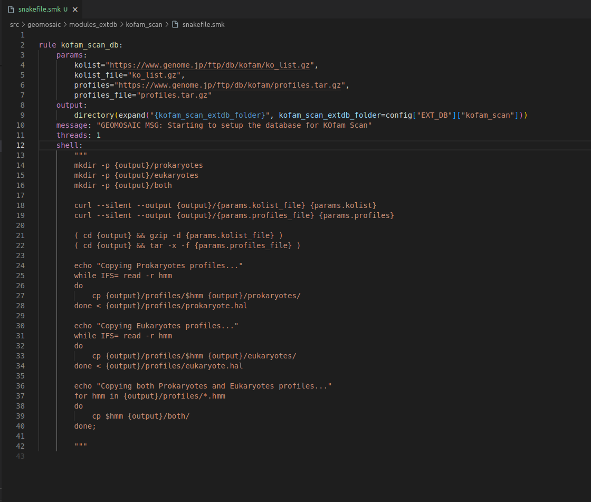

By default, we use just 1 thread for each package to perform the download of the corresponding extdb.

At the time of writing, only 9 packages requires extdb, therefore in the `slurm_extdb` template we have 9 cores, 1 core for each rule. I know is not optimized, but for now like this should be fine.

### Step 7.3: Snakefile target for extdb

In the `target.txt` we only need to put the expand line in the output section (without `directory` function of snakemake). Remember the comma at the end of the line which is very important.

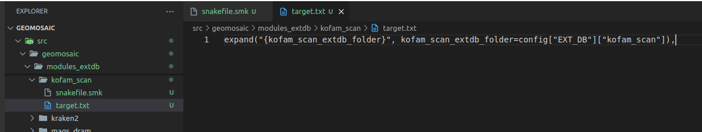

Now we can write our code inside the Snakefile.

## Step 8: Write the actual code.
For this package the code is very easy. Since it uses only the predicted orf, we can use the template of the eggnog mapper. We copy paste the code inside the `Snakefile.smk` of metaspades and then modify it.

### Step 8.1 Snakefile: `input`/`output` section
We need to change the rule definition with the package name, composed also of the prefix `run_`. 
- Our **input** section is fine, as we need only the predicted orf from the `orf_prediction` module.
- In **output** section usually we put the folder output that must be the same of the package name. However if you know that your package is going to provide in output a specific file, you can even increase the detail of this section by inserting also that file.

### Step 8.2 Snakefile: `threads` section
The threads section is fine like this. If we know that is not possible to execute our package through parallelization we can put in this section `1`, otherwise we can leave it as it is.

### Step 8.3 Snakefile: `conda` section
In this section, we only need to put our package name.

### Step 8.4 Snakefile: `params` section
In each package we put at least a param variable called `user_params`, which is going to read the `param.yaml` file that we have created in the [Step 4](#step-4-create-packages-snakefiles). The code to read user parameters, is almost always the same (so you don't need to modify it):
```python

user_params=( lambda x: " ".join(filter(None , yaml.safe_load(open(x, "r"))["kofam_scan"])) ) (config["USER_PARAMS"]["kofam_scan"])

```

Just replace `kofam_scan` with your package name.

Since this package accept a profile database for the annotation, we have inserted another param called `kofam_scan_profiles` ([Section 9](#step-9-paramyaml-file)) that is read by the following line

```python

user_kofam_profiles = (lambda x: yaml.safe_load(open(x, "r"))["kofam_scan_profiles"]) (config["USER_PARAMS"]["kofam_scan"])

```

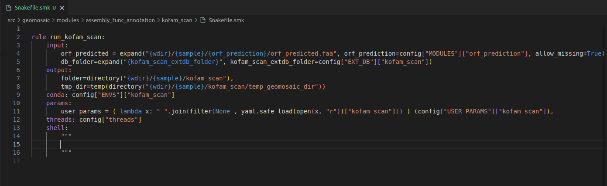

### Step 8.5 Snakefile: `shell` section
This is the section in which we are going to put the actual code to execute our programs.

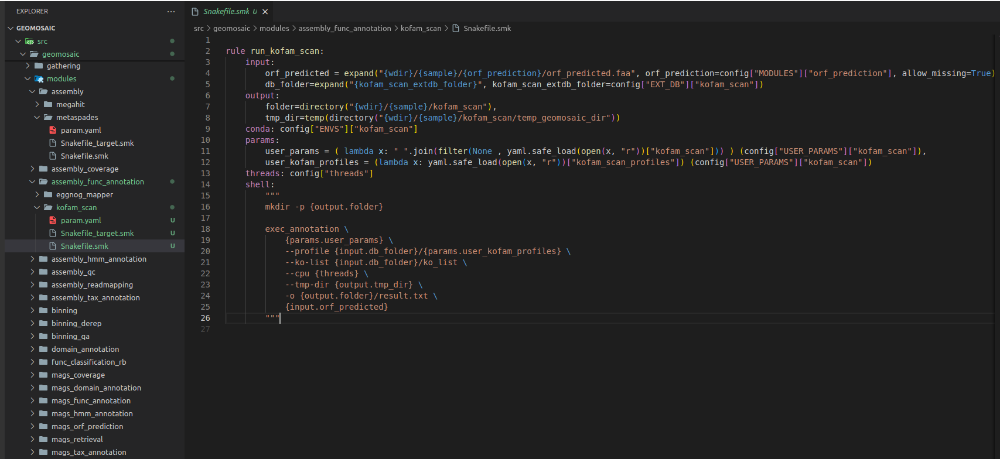

## Step 9: Snakefile Target
In our file `Snakefile_target.smk` we only need to write few rows. First, the name of the rule **must** be the same name of the package name with the `all_` prefix. And then we need to change the rows in the input section, and we need to specify the same folder output **as in this case was our only output that we specified in the Snakefile.smk**.

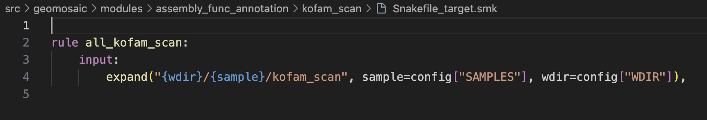

## Step 10: `Param.yaml` file

The `param.yaml` is a file in which the user, before the execution of the workflow, can insert all the optional parameters belonging to the package as bullet points. In this case, we only need to open this file and add the following lines:

```yaml
kofam_scan:
- --format detail-tsv
- 

# Allowed profiles are: prokaryotes, eukaryotes, both. Default: prokaryotes
kofam_scan_profiles: prokaryotes

```

## Test the integration
Now we should test the integrated package. Activate the conda environment of geomosaic. Updated geomosaic by doing 

```
pip install .
```

Once we have tested, we can commit the changes and create the pull request.

