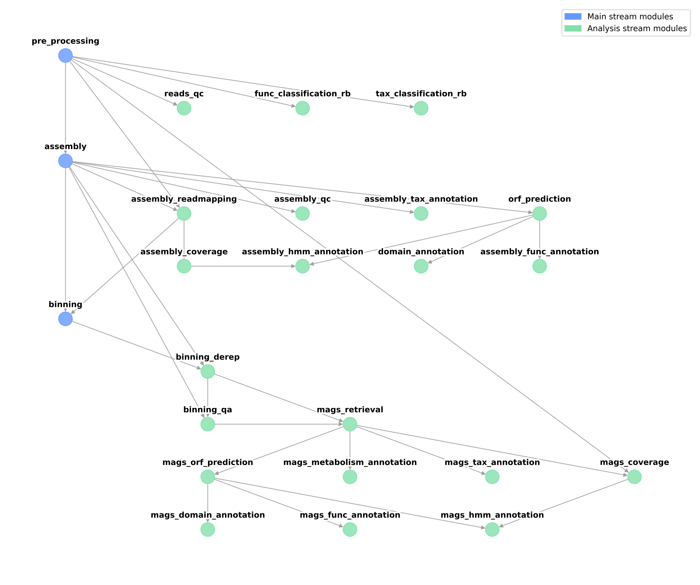

<br>


# Modules Dependencies
{: .no_toc }


In this section, we describe what is the real meaning of the module's dependencies and why each module is connected in that way.


<details open markdown="block">
  <summary>
    Table of contents
  </summary>
  {: .text-delta }
- TOC
{:toc}
</details>

-----


## Description
As we already know, Geomosaic is a modular pipeline that allows for an easy customization of metagenomics workflows, through the choice of a single package for each module.



At first look, each module may represents a type of analysis that can be performed during the metagenomics workflows. However, this description is useful but not complete as the following

{: .highlight }
A **module** is a type of metagenomics analysis that can be performed taking into consideration the dependencies to which it is linked. Therefore, a module will have specific dependencies if the package that implements that type of analysis will take in input the output of the linked modules.

Basically what matters most to define the dependencies among modules is the type of input and output of the corresponding packages. For instance, the module `assembly_readmapping` is very intuitive as the goal is to map the reads to the obtained assembly. Therefore, its dependencies are the `pre_processing` and the assembly, as we need the reads and the contigs file respectively. Indeed, in this read-mapping module, all the packages take in input the same objects and provide the same type of output (sam/bam file)

{: .note }
As it is also important, that each package provides the same type of output, otherwise downstream modules may not work with all the possible choices of the user. 

So in this module, I can integrate all the packages that I want, as long as the input and the output are the same. In this case, the reads and the assembly as input, and as output two files are called `read_mapping_sorted.bam` and `read_mapping_sorted.bam.bai`.

Another simple example to understand this concept could be the **assembly**, which can be considered one of the main points in each metagenomics workflow, both for downstream analysis and technical requirements. At the time of writing, we have integrated two packages for this task: 
- _megahit_
- _metaspades_

Both require in input the processed reads. After their computation, they provide in output the same file, which in this case is called `geomosaic_contigs.fasta` (which is a subset of the original output file of each assembly, but filtered to remove contig with len < 1000). Since for both the input is the same, the corresponding module depends on the processing of the reads (`pre_processing`).

### What if two packages perform the same type of analysis but require different inputs?
This was the case of [integration example 3](magspackage), where we wanted to implement a package (KOfam Scan) for the functional annotation of the mags. Before that integration, the only package that belonged to this module was DRAM. However, DRAM usually takes in input a folder that contains all the fasta files of the mags, which is different from the input of the kofam scan, which takes the predicted orf from a metagenome (in this case MAG). Due to this difference, both packages cannot be in the same modules as the dependencies are different. 

Therefore for that integration, I decided to change the module belonging to DRAM, calling it `mags_metabolic_function` (and leaving it linked to the `mags_retrieval`) and inserting the `mags_kofam_scan` package in a new module called `mags_functional_annotation`, which depends on the `mags_orf_prediction`. 

Modules names are used in that way just to describe what the packages do, however, it would have been the same if it was `mags_functional_annotation` for DRAM and `mags_functional_annotation_2` for kofam scan.


## Input and Output of each modules

This section reports the input and output that you should need to implement new packages for each module.

### pre_processing
{: .no_toc }

#### Input
{: .no_toc }
```python
r1="{wdir}/{sample}/R1.fastq.gz",
r2="{wdir}/{sample}/R2.fastq.gz",
```

#### Output
{: .no_toc }
```python
r1="{wdir}/{sample}/fastp/R1.fastq.gz",
r2="{wdir}/{sample}/fastp/R2.fastq.gz"
```

<br>

### reads_qc
{: .no_toc }

#### Input
{: .no_toc }
```python
r1=expand("{wdir}/{sample}/{pre_processing}/R1.fastq.gz", pre_processing=config["MODULES"]["pre_processing"], allow_missing=True),
r2=expand("{wdir}/{sample}/{pre_processing}/R2.fastq.gz", pre_processing=config["MODULES"]["pre_processing"], allow_missing=True),
```

#### Output
{: .no_toc }
No specific output for downstream modules.

<br>

### func_classification_rb
{: .no_toc }

#### Input
{: .no_toc }
```python
r1=expand("{wdir}/{sample}/{pre_processing}/R1.fastq.gz", pre_processing=config["MODULES"]["pre_processing"], allow_missing=True),
r2=expand("{wdir}/{sample}/{pre_processing}/R2.fastq.gz", pre_processing=config["MODULES"]["pre_processing"], allow_missing=True),
```

#### Output
{: .no_toc }
No specific output for downstream modules.

<br>

### tax_classification_rb
{: .no_toc }

#### Input
{: .no_toc }
```python
r1=expand("{wdir}/{sample}/{pre_processing}/R1.fastq.gz", pre_processing=config["MODULES"]["pre_processing"], allow_missing=True),
r2=expand("{wdir}/{sample}/{pre_processing}/R2.fastq.gz", pre_processing=config["MODULES"]["pre_processing"], allow_missing=True),
```

#### Output
{: .no_toc }
No specific output for downstream modules.

<br>

### assembly
{: .no_toc }

#### Input
{: .no_toc }
```python
r1=expand("{wdir}/{sample}/{pre_processing}/R1.fastq.gz", pre_processing=config["MODULES"]["pre_processing"], allow_missing=True),
r2=expand("{wdir}/{sample}/{pre_processing}/R2.fastq.gz", pre_processing=config["MODULES"]["pre_processing"], allow_missing=True),
```

#### Output
{: .no_toc }
```python
output_fasta="{wdir}/{sample}/metaspades/geomosaic_contigs.fasta",
```

<br>

### assembly_readmapping
{: .no_toc }

#### Input
{: .no_toc }
```python
r1=expand("{wdir}/{sample}/{pre_processing}/R1.fastq.gz", pre_processing=config["MODULES"]["pre_processing"], allow_missing=True),
r2=expand("{wdir}/{sample}/{pre_processing}/R2.fastq.gz", pre_processing=config["MODULES"]["pre_processing"], allow_missing=True),
gm_contigs=expand("{wdir}/{sample}/{assembly}/geomosaic_contigs.fasta", assembly=config["MODULES"]["assembly"], allow_missing=True)
```

#### Output
{: .no_toc }
```python
sorted_bam="{wdir}/{sample}/bowtie2/read_mapping_sorted.bam",
indexed_bam="{wdir}/{sample}/bowtie2/read_mapping_sorted.bam.bai"
```

<br>

### assembly_qc
{: .no_toc }

#### Input
{: .no_toc }
```python
gm_contigs=expand("{wdir}/{sample}/{assembly}/geomosaic_contigs.fasta", assembly=config["MODULES"]["assembly"], allow_missing=True),
```

#### Output
{: .no_toc }
No specific output for downstream modules.

<br>

### assembly_coverage
{: .no_toc }

#### Input
{: .no_toc }
```python
sorted_bam=expand("{wdir}/{sample}/{assembly_readmapping}/read_mapping_sorted.bam", assembly_readmapping=config["MODULES"]["assembly_readmapping"], allow_missing=True),
indexed_bam=expand("{wdir}/{sample}/{assembly_readmapping}/read_mapping_sorted.bam.bai", assembly_readmapping=config["MODULES"]["assembly_readmapping"], allow_missing=True),
```

#### Output
{: .no_toc }
No specific output for downstream modules.

<br>

### assembly_tax_annotation
{: .no_toc }

#### Input
{: .no_toc }
```python
gm_contigs=expand("{wdir}/{sample}/{assembly}/geomosaic_contigs.fasta", assembly=config["MODULES"]["assembly"], allow_missing=True),
```

#### Output
{: .no_toc }
No specific output for downstream modules.

<br>

### orf_prediction
{: .no_toc }

#### Input
{: .no_toc }
```python
gm_contigs=expand("{wdir}/{sample}/{assembly}/geomosaic_contigs.fasta", assembly=config["MODULES"]["assembly"], allow_missing=True),
```

#### Output
{: .no_toc }
```python
output_fasta = "{wdir}/{sample}/prodigal/orf_predicted.faa",
output_simple_mapping = "{wdir}/{sample}/prodigal/simple_orf_contig_mapping.tsv", 
```

<br>

### assembly_func_annotation
{: .no_toc }

#### Input
{: .no_toc }
```python
orf_predicted = expand("{wdir}/{sample}/{orf_prediction}/orf_predicted.faa", orf_prediction=config["MODULES"]["orf_prediction"], allow_missing=True),
```

#### Output
{: .no_toc }
No specific output for downstream modules.

<br>

### domain_annotation
{: .no_toc }

#### Input
{: .no_toc }
```python
orf_predicted = expand("{wdir}/{sample}/{orf_prediction}/orf_predicted.faa", orf_prediction=config["MODULES"]["orf_prediction"], allow_missing=True),
```

#### Output
{: .no_toc }
No specific output for downstream modules.

<br>

### assembly_hmm_annotation
{: .no_toc }

#### Input
{: .no_toc }
```python
orf_predicted = expand("{wdir}/{sample}/{orf_prediction}/orf_predicted.faa", orf_prediction=config["MODULES"]["orf_prediction"], allow_missing=True),
orf_simple_mapping = expand("{wdir}/{sample}/{orf_prediction}/simple_orf_contig_mapping.tsv", orf_prediction=config["MODULES"]["orf_prediction"], allow_missing=True), 
coverage_folder = expand("{wdir}/{sample}/{assembly_coverage}", assembly_coverage=config["MODULES"]["assembly_coverage"], allow_missing=True)
```

#### Output
{: .no_toc }
No specific output for downstream modules.

<br>

### binning
{: .no_toc }

#### Input
{: .no_toc }
```python
sorted_bam=expand("{wdir}/{sample}/{assembly_readmapping}/read_mapping_sorted.bam", assembly_readmapping=config["MODULES"]["assembly_readmapping"], allow_missing=True),
indexed_bam=expand("{wdir}/{sample}/{assembly_readmapping}/read_mapping_sorted.bam.bai", assembly_readmapping=config["MODULES"]["assembly_readmapping"], allow_missing=True),
gm_contigs=expand("{wdir}/{sample}/{assembly}/geomosaic_contigs.fasta", assembly=config["MODULES"]["assembly"], allow_missing=True)
```

#### Output
{: .no_toc }
```python
maxbin_bins=directory("{wdir}/{sample}/multi_binners/geomosaic_maxbin2_bins"),
metabat_bins=directory("{wdir}/{sample}/multi_binners/geomosaic_metabat2_bins"),
semibin_bins=directory("{wdir}/{sample}/multi_binners/geomosaic_semibin2_bins")
```

<br>

### binning_derep
{: .no_toc }

#### Input
{: .no_toc }
```python
semibin_bins=expand("{wdir}/{sample}/{binning}/geomosaic_semibin2_bins", binning=config["MODULES"]["binning"], allow_missing=True),
maxbin_bins=expand("{wdir}/{sample}/{binning}/geomosaic_maxbin2_bins", binning=config["MODULES"]["binning"], allow_missing=True),
metabat_bins=expand("{wdir}/{sample}/{binning}/geomosaic_metabat2_bins", binning=config["MODULES"]["binning"], allow_missing=True),
gm_contigs=expand("{wdir}/{sample}/{assembly}/geomosaic_contigs.fasta", assembly=config["MODULES"]["assembly"], allow_missing=True)
```

#### Output
{: .no_toc }
No specific output for downstream modules.

<br>

### binning_qa
{: .no_toc }

#### Input
{: .no_toc }
```python
dins_derep=expand("{wdir}/{sample}/{binning_derep}", binning_derep=config["MODULES"]["binning_derep"], allow_missing=True),
gm_contigs=expand("{wdir}/{sample}/{assembly}/geomosaic_contigs.fasta", assembly=config["MODULES"]["assembly"], allow_missing=True),
```

#### Output
{: .no_toc }
No specific output for downstream modules.

<br>

### mags_retrieval
{: .no_toc }

#### Input
{: .no_toc }
```python
dins_derep=expand("{wdir}/{sample}/{binning_derep}", binning_derep=config["MODULES"]["binning_derep"], allow_missing=True),
checkm_folder=expand("{wdir}/{sample}/{binning_qa}", binning_qa=config["MODULES"]["binning_qa"], allow_missing=True)
```

#### Output
{: .no_toc }
```python
folder = directory("{wdir}/{sample}/mags"),
mags_file = "{wdir}/{sample}/mags/MAGs.tsv",
mags_general_file = "{wdir}/{sample}/MAGs.tsv",
```

<br>

### mags_metabolism_annotation
{: .no_toc }

#### Input
{: .no_toc }
```python
mags_folder=expand("{wdir}/{sample}/{mags_retrieval}", mags_retrieval=config["MODULES"]["mags_retrieval"], allow_missing=True),
```

#### Output
{: .no_toc }
No specific output for downstream modules.

<br>

### mags_tax_annotation
{: .no_toc }

#### Input
{: .no_toc }
```python
mags_folder=expand("{wdir}/{sample}/{mags_retrieval}", mags_retrieval=config["MODULES"]["mags_retrieval"], allow_missing=True),
```

#### Output
{: .no_toc }
No specific output for downstream modules.

<br>

### mags_orf_prediction
{: .no_toc }

#### Input
{: .no_toc }
```python
fasta=expand("{wdir}/{sample}/{mags_retrieval}/fasta/{mag}.fa", mags_retrieval=config["MODULES"]["mags_retrieval"], allow_missing=True)
```

#### Output
{: .no_toc }
```python
output_fasta = "{wdir}/{sample}/mags_prodigal/{mag}/orf_predicted.faa",
output_simple_mapping = "{wdir}/{sample}/mags_prodigal/{mag}/simple_orf_contig_mapping.tsv",
```

<br>

### mags_domain_annotation
{: .no_toc }

#### Input
{: .no_toc }
```python
mags_orf=expand("{wdir}/{sample}/{mags_orf_prediction}/{mag}/orf_predicted.faa", mags_orf_prediction=config["MODULES"]["mags_orf_prediction"], allow_missing=True),
```

#### Output
{: .no_toc }
No specific output for downstream modules.

<br>

### mags_func_annotation
{: .no_toc }

#### Input
{: .no_toc }
```python
mags_orf=expand("{wdir}/{sample}/{mags_orf_prediction}/{mag}/orf_predicted.faa", mags_orf_prediction=config["MODULES"]["mags_orf_prediction"], allow_missing=True),
```

#### Output
{: .no_toc }
No specific output for downstream modules.

<br>

### mags_coverage
{: .no_toc }

#### Input
{: .no_toc }
```python
r1=expand("{wdir}/{sample}/{pre_processing}/R1.fastq.gz", pre_processing=config["MODULES"]["pre_processing"], allow_missing=True),
r2=expand("{wdir}/{sample}/{pre_processing}/R2.fastq.gz", pre_processing=config["MODULES"]["pre_processing"], allow_missing=True),
mags_folder=expand("{wdir}/{sample}/{mags_retrieval}", mags_retrieval=config["MODULES"]["mags_retrieval"], allow_missing=True),
```

#### Output
{: .no_toc }
No specific output for downstream modules.

<br>

### mags_hmm_annotation
{: .no_toc }

#### Input
{: .no_toc }
```python
mags_orf=expand("{wdir}/{sample}/{mags_orf_prediction}/{mag}/orf_predicted.faa", mags_orf_prediction=config["MODULES"]["mags_orf_prediction"], allow_missing=True),
```

#### Output
{: .no_toc }
No specific output for downstream modules.
