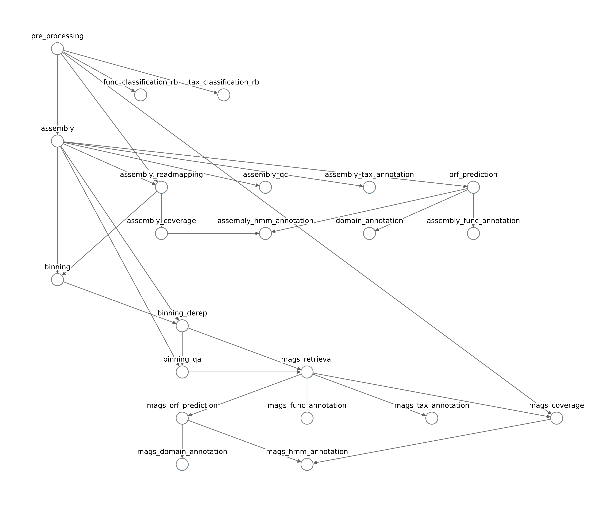

# `geomosaic workflow`

```{caution}
Before running a workflow from scratch up to the modules related to MAGs annotation, please read this [suggestion](../tips/suggestions.md#create-your-workflow-in-two-major-steps).

```

## Overview

After having successfully executed the `setup` command, Geomosaic is ready to create your desired workflow.

```
geomosaic workflow --help
```

```
usage: geomosaic workflow -s SETUP_FILE [-t THREADS] [-p {just_mags,glab,None}] [-m MODULE] [-h]

DESCRIPTION: It allows to choose the desired modules and the relative packages. Based on you choices, the command will create a Snakefile (in the geomosaic directory) with the chosen modules, the config file for snakemake, and a graph image to show the created workflow

Required Arguments:
  -s SETUP_FILE, --setup_file SETUP_FILE
                        Geomosaic setup file created from the geomosaic setup ... command.

Optional Arguments:
  -t THREADS, --threads THREADS
                        Threads to use (per sample).
  -p {just_mags,glab,None}, --pipeline {just_mags,glab,None}
                        Execute a default Giovannelli's Lab pipeline of Geomosaic (Completeness 50, Contamination 10). The pipeline 'glab' is a full
                        pipeline without the two modules on HMM annotation (assemby and mags). The pipeline 'just_mags' is a minimal set of modules to
                        retrieve MAGs without any annotation (Completeness: 50, Contamination: 10).
  -m MODULE, --module_start MODULE
                        Module where to start creating the workflow (Default: pre_processing)

Available Modules:
  
  - pre_processing - Module: Pre processing with quality check
  - reads_qc - Module: Quality check (and/or Reads Count) of the reads after Pre-Processing
  - func_classification_rb - Module: Functional classification [Read-based]
  - tax_classification_rb - Module: Taxonomic classification [Read-based]
  - assembly - Module: Assembly
  - assembly_func_annotation - Module: Functional Annotation on Assembly [Assembly-based]
  - assembly_qc - Module: Assembly quality evaluation with metrics [Assembly-based]
  - assembly_readmapping - Module: Read mapping the processed reads to the Assembly [Assembly-based]
  - assembly_coverage - Module: Assembly coverage computation [Assembly-based]
  - assembly_tax_annotation - Module: Taxonomic Annotation on Assembly [Assembly-based]
  - orf_prediction - Module: perform ORF prediction [Assembly-based]
  - domain_annotation - Module: Domain annotation on Assembly [Assembly-based]
  - assembly_hmm_annotation - Module: tracking coverage for genes of interest through HMM models [Assembly-based]
  - assembly_orf_annotation - Module: Functional Annotation on Assembly (ORFs) [Assembly-based]
  - binning - Module: Binning
  - binning_derep - Module: Binning Deeplication [Binning-based]
  - binning_qa - Module: Binning Quality Evaluation [Binning-based]
  - mags_retrieval - Module: get MAGs based on Contamination and Completeness threshold [Binning-based]
  - mags_func_annotation - Module: perform functional annotation on MAGs [Binning-based]
  - mags_tax_annotation - Module: Perform taxonomic annotation of filtered MAGs [Binning-based]
  - mags_orf_prediction - Module: perform ORF prediction for each retrieved MAG [Binning-based]
  - mags_domain_annotation - Module: perform domain-based annotation for each retrieved MAG [Binning-based]
  - mags_orf_annotation - Module: perform functional annotation on ORF retrieved from filtered MAGs [Binning-based]
  - mags_coverage - Module: Computing read coverage for each retrieved MAG [Binning-based]
  - mags_hmm_annotation - Module: tracking coverage for genes of interest through HMM models on MAGs [Binning-based]

Help Arguments:
  -h, --help            show this help message and exit

```

## Arguments

This command has both one required and different optional arguments:

- __REQUIRED__
    - (`-s`) Specifiy the name of the Geomosaic config file, obtained with the `setup` command.
- __OPTIONAL__
    - (`-p <pipeline>`) With this flag, the user can choose already pre-defined workflows. Currently, two pipeline are integrated: `glab` which contains most of the annotation in all the stream levels, `just_mags` that allows to run the minimal modules to obtain the mags. Both pipelines are now though to run with `completeness` and `contamination` values of 50 and 10 respectively.
    - (`-m`) Module where to start creating the workflow (Default: pre_processing)
    - (`-t`) Threads to use (per sample)

## What to expect from this command
After completing this command, Geomosaic generates three files in its working directory:
- `Snakefile.smk` - the Snakefile with the rules for each chosen module. This is the real pipeline;
- `config.yaml` - the config file for snakemake execution (which is different from the config file generated by `geomosaic setup`);
- `Snakefile_extdb.smk` - An additional Snakefile containing all the codes to setup external databases of the chosen packages. __This snakefile will be the first to be executed, in order to download the required data__.


```{image} assets/images/gm_workflow/geomosaic_workflow_output.png
:width: 300
:class: no-scaled-link
:align: center
```

It's all automated.


## Example usage `geomosaic workflow`

**`IMPORTANT:` the following images may not refer to the modules that are integrated in the current version of Geomosaic. However, these images are very useful to understand how it works the creation of the workflow works.** 

By executing this command, Geomosaic starts loading the provided config file, and then it asks for the desired package to be used for each module.
It is important to considered the above mentioned dependencies among the modules:




```
geomosaic workflow -s gmsetup_exp2023.yaml
```

```
Geomosaic Process: Loading variables from Geomosaic setup file... 
--> OK <--

[PRE_PROCESSING] - Module: Pre processing with quality check
0) -- Ignore this module (and all successors) --
1) fastp
2) Trim-Galore
3) Trimmomatic
1

[FUNC_CLASSIFICATION_RB] - Module: Functional classification [Read-based]
0) -- Ignore this module (and all successors) --
1) mi-faser (GS-21-all)
0

[TAX_CLASSIFICATION_RB] - Module: Taxonomic classification [Read-based]
0) -- Ignore this module (and all successors) --
1) Kaiju
2) MetaPhlAn
0

```

As it is shown, geomosaic will ask for each module the desired package, waiting for the user input.

this input must be a integer value corresponding to the choice. Typing `0` will ignore the module and all the next modules that depends on it. In this case, `fastp` was chosen by typing `1`, and the modules `func_classification_rb` `tax_classification_rb` were ignored.

```{image} assets/images/gm_workflow/read_based.png
:width: 600
:class: no-scaled-link
:align: center
```

```
[ASSEMBLY] - Module: Assembly
0) -- Ignore this module (and all successors) --
1) MetaSpades
2) MegaHit
1

[ASSEMBLY_READMAPPING] - Module: Assembly evaluation by read mapping [Assembly-based]
0) -- Ignore this module (and all successors) --
1) Bowtie2
2) BBMap
1

[ASSEMBLY_QC] - Module: Assembly evaluation with metrics [Assembly-based]
0) -- Ignore this module (and all successors) --
1) Quast
0

[ASSEMBLY_TAX_ANNOTATION] - Module: Taxonomic Annotation on Assembly [Assembly-based]
0) -- Ignore this module (and all successors) --
1) Kraken2
1

[ORF_PREDICTION] - Module: perform ORF prediction [Assembly-based]
0) -- Ignore this module (and all successors) --
1) Prodigal
1


```

```{image} assets/images/gm_workflow/assembly_based_1.png
:width: 700
:class: no-scaled-link
:align: center
```

```
[ASSEMBLY_COVERAGE] - Module: Assembly coverage computation [Assembly-based]
0) -- Ignore this module (and all successors) --
1) CoverM (Contigs)
0

[ASSEMBLY_FUNC_ANNOTATION] - Module: Functional Annotation on Assembly [Assembly-based]
0) -- Ignore this module (and all successors) --
1) eggNOG-Mapper
1

[DOMAIN_ANNOTATION] - Module: Domain annotation on Assembly [Assembly-based]
0) -- Ignore this module (and all successors) --
1) reCOGnizer
0

```

```{image} assets/images/gm_workflow/assembly_based_2.png
:width: 700
:class: no-scaled-link
:align: center
```


__*IMPORTANT*__: Since that the module `assembly_coverage` is ignored, the module `assembly_hmm_annotation` is skipped as it depends upon `assembly_coverage`.


At this point Geomosaic continues asking for modules

```
[BINNING] - Module: Binning
0) -- Ignore this module (and all successors) --
1) MaxBin2 + MetaBat2 + SemiBin2
1

[BINNING_DEREP] - Module: Binning Deeplication [Binning-based]
0) -- Ignore this module (and all successors) --
1) DAS_tool
1

[BINNING_QA] - Module: Binning Quality Evaluation [Binning-based]
0) -- Ignore this module (and all successors) --
1) CheckM
1

[MAGS_RETRIEVAL] - Module: get MAGs based on Contamination and Completeness threshold [Binning-based]
0) -- Ignore this module (and all successors) --
1) MAGs HQ
1

[MAGS_FUNC_ANNOTATION] - Module: Perform annotation of filtered MAGs [Binning-based]
0) -- Ignore this module (and all successors) --
1) DRAM on MAGs
1

[MAGS_TAX_ANNOTATION] - Module: Perform taxonomic annotation of filtered MAGs [Binning-based]
0) -- Ignore this module (and all successors) --
1) GTDBTK on MAGs
1

[MAGS_ORF_PREDICTION] - Module: perform ORF prediction for each retrieved MAG [Binning-based]
0) -- Ignore this module (and all successors) --
1) Prodigal on MAGs
0

[MAGS_COVERAGE] - Module: Computing read coverage for each retrieved MAG [Binning-based]
0) -- Ignore this module (and all successors) --
1) CoverM (Genome)
1


```

```{image} assets/images/gm_workflow/binning_based.png
:width: 700
:class: no-scaled-link
:align: center
```

Also in this situation, since that the module `mags_orf_prediction` has been ignored, the module `mags_hmm_annoation` has been removed due to the ignored dependency.

After having chosen all desired modules, Geomosaic asks for values for additional parameters. For instance, in the workflow described above the module `MAGs Retrieval` was chosen. Since it regards the retrieval of high quality MAGs based on the contamination and completness, Geomosaic asks the user additional parameters.

```
[Additional Parameter to retrieve HQ MAGs] Description: COMPLETENESS parameters to filter retrieved bins
Required parameter: integer value - Suggested value: 90: 
90

[Additional Parameter to retrieve HQ MAGs] Description: CONTAMINATION parameters to filter retrieved bins
Required parameter: integer value - Suggested value: 10: 
10
 
Geomosaic Process: Building preliminary workflow to prepare all the database of your workflow...
--> OK <--
```

The resulting conceptual map of the modules should be as follows:

```{image} assets/images/gm_workflow/modules_DAG_workflow.png
:class: no-scaled-link
:align: center
```
