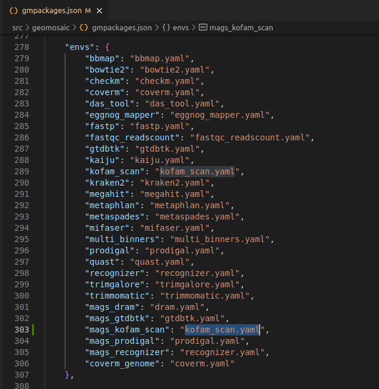
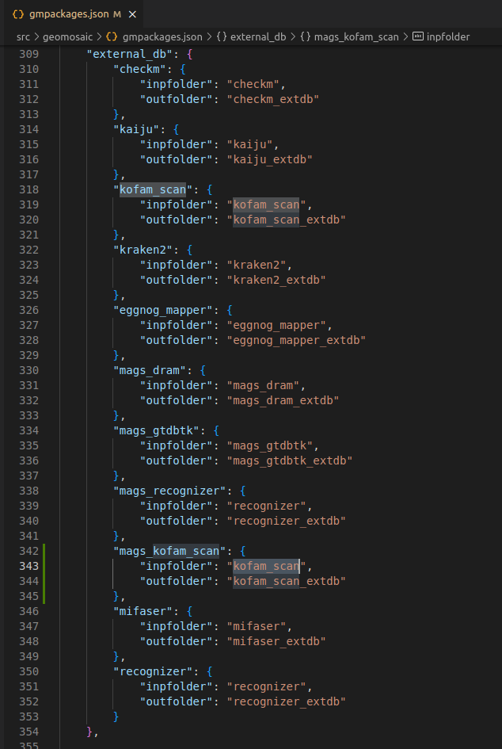
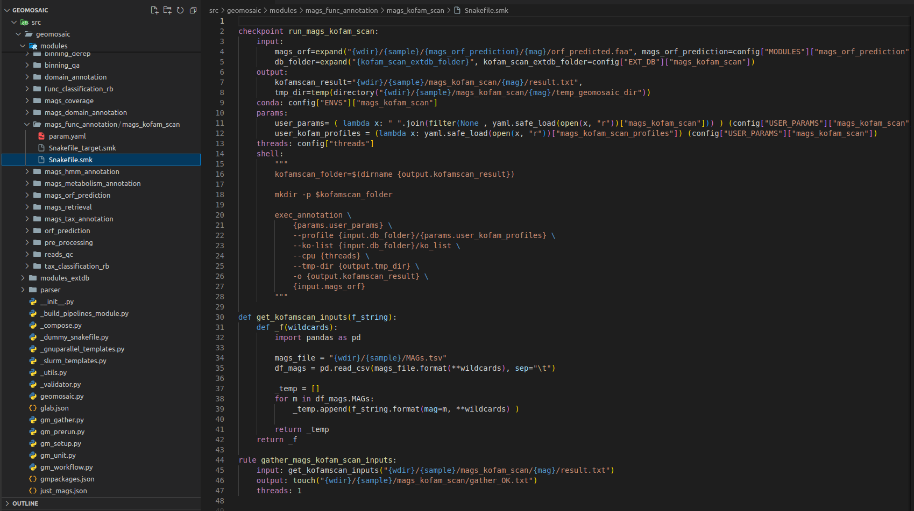
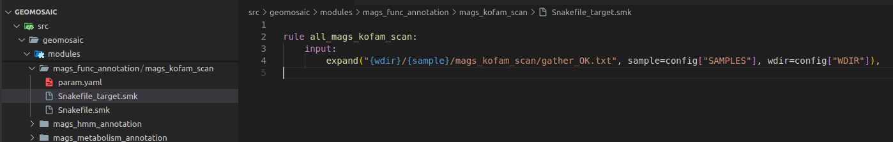
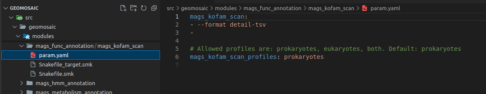

# Integration example 3: Package for MAGs (Binning-level) with extdb

This tutorial will guide you through an integration of an example package, that requires an **external database** and it is **referred to MAGs module**. If this is your first time that reads a guide to our contribute section, we suggest you to read first the other two example.

## What we need for this integration
- Understand the Stream-level: in this case `Binning-based`
- Module name: `mags_func_annotation`
- Package name: `mags_kofam_scan`
- Know which are the conda dependencies for this packages, or the conda package name.
- Know the code to actual integrate and execute the package.

## Step 1: Clone/fork the repository and install Geomosaic

Since the final strategy is to make a pull request to the main repository, we suggest to fork our repo and then clone it (in the SSH way)
```
git@github.com:<YOURNAME>/Geomosaic.git
```
Install the Geomosaic conda environment. You can follow the [Installation Guide](../introduction).

Remember to replace `<YOURNAME>` with your GitHub user account.

Once you have cloned the repository, open the directory created with the clone and also create another branch specifying the name of the package that you are going to integrate

```
git checkout -b mags_kofam_scan
```

## Step 2: Create the module folder (if does not exists)

```{note}
As we can intuitively think, KOfam Scan is a package for the functional annotation, in this case for the mags. Before this integration, the only package that belonged to this module was DRAM. However, DRAM usually takes in input a folder that contains all the fasta files of the mags, which is different from the input of the kofam scan, which takes the predicted orf from a single MAG.
```

Due to this difference, both packages cannot be in the same modules as the dependencies are different. So I decided to change the module belonging to DRAM, calling it `mags_metabolism_annotation` and insert `mags_kofam_scan` in the `mags_functional_annotation`, which depends on the mags_orf_prediction. Modules names are just to describe what the packages do, however, it would have been the same if it was `mags_functional_annotation` for DRAM and `mags_functional_annotation_2` for kofam scan.

## Step 3: Create the package folder

We need to create the package folder inside the corresponding module, which in this case is `mags_func_annotation`. Since we are going to integrate the program called `KOfam Scan` for MAGs, we can create a folder called `mags_kofam_scan`.


```{warning}
__Do not__ use any special characters or insert spaces in the name.
```

```{admonition} Highlight
:class: important

Just rely on _underscore_ and all lower-case characters
```

## Step 4: Create package's snakefiles

Now we need to create the three files where we are going to implement all the necessary code:
- `Snakefile.smk`
- `Snakefile_target.smk`
- `param.yaml`

For now you can leave them empty.

```{important}
The names for this file are standard and are the same for each package. Do not change the filenames.
```

## Step 5: create the corresponding `conda` env file 
For this step, we don't need to create the corresponding `conda` env file as we have already created for the [Integration Example 2](extdb.md#step-5-create-the-corresponding-conda-env-file)

Now we can write our code inside the Snakefile

## Step 6: Link the module/package to the Geomosaic core

So in this section we need to link our new module and/or our new package to the already existing core of Geomosaic, which is represented by the file called `gmpackages.json`. 
Let's see how to do it.

### Step 6.1: `order` section

Since this module depends on the predicted orfs from each mags, we insert this modules after the `mags_orf_prediction`.

```
...
"mags_orf_prediction",
"mags_domain_annotation",
"mags_func_annotation",
...
```

### Step 6.2: `graph` section

Since this module depends on the predicted orfs from each mags, we insert this modules linked to the `mags_orf_prediction`.
 
```
...
["mags_orf_prediction", "mags_func_annotation"],
...
```

### Step 6.3: `modules` section

In the corresponding `modules` section, we need to add the name of our package in our `choices`, which is a dictionary containing all the packages belonging to that module. 
<br>

In particolar, the **key** (the blu string in the image) is the string that will come out in the terminal as a choice, during the workflow decision, while the **value** (in orange) is the actual name of the package, the one that we used also to create the folder in step 3. 
    
```{important}
Package name on the **value** must match with the folder created in the step 3
```

Here we can see how DRAM was moved into the `mags_metabolism_annotation` module.
```
"modules": {
...
    "mags_metabolism_annotation": {
            "description": "Module: Perform annotation of metabolism on filtered MAGs [Binning-based]",
            "choices": {
                "DRAM on MAGs": "mags_dram"
            }
        },
...
        "mags_func_annotation": {
            "description": "Module: perform functional annotation on ORF retrieved from filtered MAGs [Binning-based]",
            "choices": {
                "KOfam Scan on MAGs": "mags_kofam_scan"
            }
        },
...
```

### Step 6.4: `additional_input` section
If the package does require any additional input, you can integrate this input in the corresponding section of `additional_input`. In this case we don't need to put any additional argument. 


```{admonition} Highlight
:class: important

Additional arguments are parameters that are widely known in the metagenomic workflow and that should be chosen by the user, as for example Completeness and Contamination.
```

In this section we have inserted also the possibility to specificy a folder that contains HMM models (for `assembly_hmm_annotation` and `mags_hmm_annotation`), as well as the name of the output folder these two modules in order to have different output name folder for different sets of HMMs.

### Step 6.5: `envs` section
This section is very simple, we only need to add the conda env file for our package that we have created in the [Step 5](#step-5-create-the-corresponding-conda-env-file). This filename must have the same package name. In this case `kofam_scan`. 



### Step 6.6: `external_db` section
```{note}
Still under optimization
```

This section is useful to organize external databases for the package that we are going to integrate. In this example, we need an external database (extdb).

In this section:
- each package that requires an extdb has a key which contains two other keys:
  - `inpfolder`: its value should be the name of the package
  - `outfolder`: must be the name of the folder in which the external databases is going to be downloaded. The pattern is: the name of the package followed by the `_extdb` suffix. However, different package name maybe relay on the same external database as it is for the `recognizer` package and `mags_recognizer`, therefore in such case we specify the same `outfolder`.

So in this section we are going to write as follows since the external database is the same for the KOfam Scan that we have integrated in the `assembly_func_annotation` ([Integration Example 2](extdb)).


### Step 6.7: `gathering` section
This section is not mandatory. However it is useful if we want to compose some master tables or plots from the results of our package from all the samples computation. In this case, we are not interest in this section. However we could create a script that creates a table of all the reads count for each sample.

At the time of writing, this is the last section in the `gmpackages.json`.

## Step 7: How to organize the code for the External Database (extdb).
You can see this section in the [Integration example 2](extdb).

## Step 8: Write the actual code.

To my knowledge, for the binning-based stream level there are two types of tool:
- the first one are those that take into consideration as input all the fasta files inside a folder, like DRAM or GTDBTK. Indeed, their dependency is the `mags_retrieval`.
- the second regards instead the tools that mainly take as input one fasta file at the time, like _Prodigal_ or _KOfam Scan_ which takes in input one predicted orf (fasta file) at the time.

For this latter case, it is essential to retrieve all the mags that we have and then refer to the fasta file for that mags. Many example are already integrated in Geomosaic, so we can start from that.

We can use the template of the `mags_recognizer` from the module `mags_domain_annotation`.

### Step 8.1 Snakefile: `input`/`output` section
We need to change the rule definition with the package name, composed also of the prefix `run_`. 
- Our **input** section is fine, as we need only the predicted orf from each mags (`mags_orf_prediction` module).
- In **output** section usually we put the folder output that must be the same of the package name. However if you know that your package is going to provide in output a specific file, you can even increase the detail of this section by inserting also that file.

### Step 8.2 Snakefile: `threads` section
The threads section is fine like this. If we know that is not possible to execute our package through parallelization we can put in this section `1`, otherwise we can leave it as it is.

### Step 8.3 Snakefile: `conda` section
In this section, we only need to put our package name.

### Step 8.4 Snakefile: `params` section
In each package we put at least a param variable called `user_params`, which is going to read the `param.yaml` file that we have created in the [Step 4](#step-4-create-packages-snakefiles). The code to read user parameters, is almost always the same (so you don't need to modify it):

```python

user_params=( lambda x: " ".join(filter(None , yaml.safe_load(open(x, "r"))["mags_kofam_scan"])) ) (config["USER_PARAMS"]["mags_kofam_scan"])

```

Just replace `mags_kofam_scan` with your package name.

Since this package accept a profile database for the annotation, we have inserted another param called `mags_kofam_scan_profiles` ([Section 10](#step-10-paramyaml-file)) that is read by the following line

```python

user_kofam_profiles = (lambda x: yaml.safe_load(open(x, "r"))["mags_kofam_scan_profiles"]) (config["USER_PARAMS"]["mags_kofam_scan"])

```

### Step 8.5 Snakefile: `shell` section
This is the section in which we are going to put the actual code to execute our programs.



## Step 9: Snakefile Target
In our file `Snakefile_target.smk` we only need to write few rows. First, the name of the rule **must** be the same name of the package name with the `all_` prefix. And then we need to change the rows in the input section, and we need to specify the same folder output **as in this case was our only output that we specified in the Snakefile.smk**.



## Step 10: `Param.yaml` file

The `param.yaml` is a file in which the user, before the execution of the workflow, can insert all the optional parameters belonging to the package as bullet points. In this case, we only need to open this file and add the following lines:



## Test the integration
Now we should test the integrated package. Activate the conda environment of geomosaic. Updated geomosaic by doing 

```
pip install .
```

Once we have tested, we can commit the changes and create the pull request.

