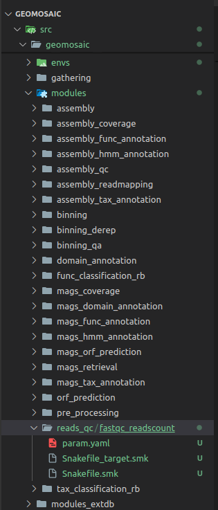
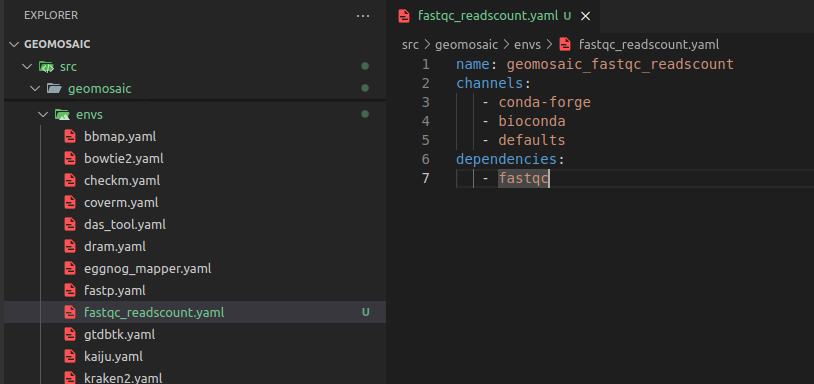
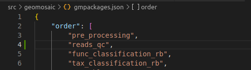
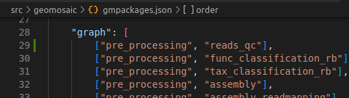
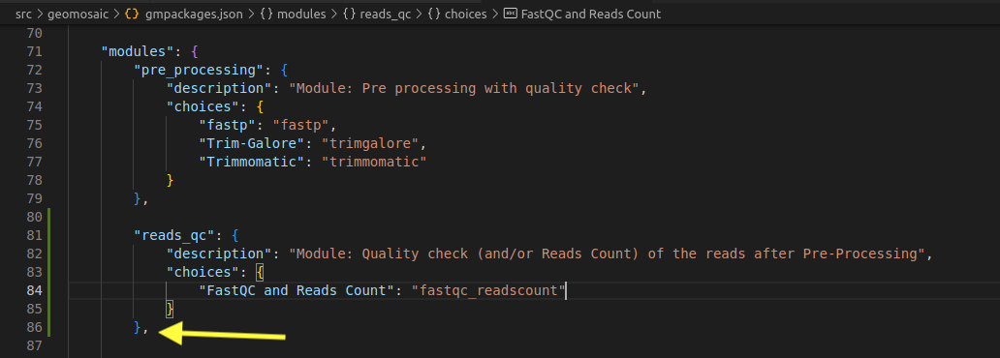
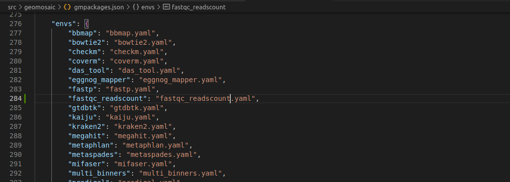
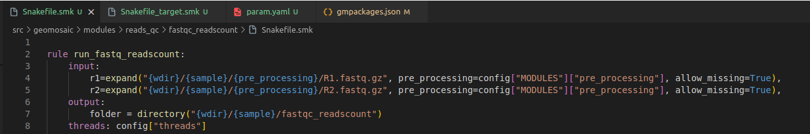
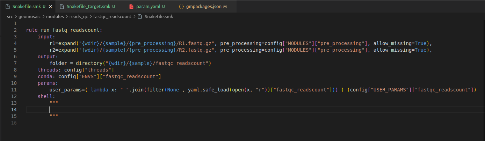
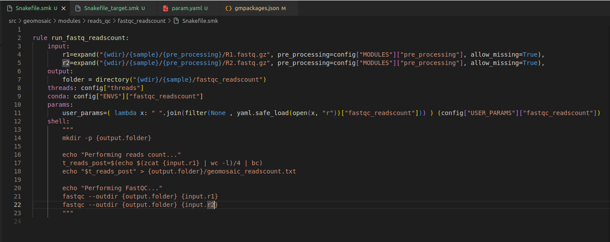
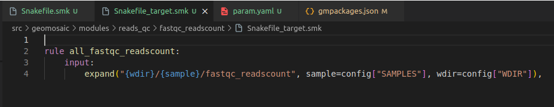

# Integration example 1: Simple package

<br>


This tutorial will guide you through an integration of a simple package, that doesn't need an **external database** and it is **not referred to MAGs module**.

## What we need for this integration
- Understand the Stream-level: in this case `Read-based`
- Module name: `reads_qc`
- Package name: `fastqc_readscount`
- Know which are the conda dependencies for this packages, or the conda package name.
- Know the code to actual integrate and execute the package.

## Step 1: Clone/fork the repository and install Geomosaic

Since the final strategy is to make a pull request to the main repository, we suggest to fork our repo and then clone it (in the SSH way)
```
git@github.com:<YOURNAME>/Geomosaic.git
```
Install the Geomosaic conda environment. You can follow the [Installation Guide](../introduction).

Remember to replace `<YOURNAME>` with your GitHub user account.

Once you have cloned the repository, open the directory created with the clone and also create another branch specifying the name of the package that you are going to integrate

```
git checkout -b fastqc
```


## Step 2: Create the module folder (if does not exists)
In this case we are going to integrate a package that belongs to a module related to the quality checks of the reads after the `pre_processing` step, so we create a module folder called `reads_qc` inside the `modules` folder (Figure below in [Step 4](#step-4-create-packages-snakefiles)). 

{: .important }
This step is necessary only if the module folder does not exists.

{: .highlight }
> {: .warning }
> __Do not__ use any special characters or insert spaces in the name.
>
> Just rely on _underscore_ and all lower-case characters


## Step 3: Create the package folder

In this step we create the package folder inside the module of interest. In this case, our package folder will be `fastqc_readscount` (Figure below in [Step 4](#step-4-create-packages-snakefiles)).

{: .highlight }
> {: .warning }
> __Do not__ use any special characters or insert spaces in the name.
>
> Just rely on _underscore_ and all lower-case characters


## Step 4: Create package's snakefiles

Create three code files inside the package folder, with the following filename:
- `Snakefile.smk`
- `Snakefile_target.smk`
- `param.yaml`

For now you can leave them empty.

{: .important }
The names for this file are standard and are the same for each package. Do not change the filenames.



## Step 5: create the corresponding `conda` env file 
We need to create the corresponding `conda` env file describing the necessary dependencies for our package.  For this purpose, in the `envs` folder we create a file with the same name of the package (with the yaml extension). As content of the file we are going to write the necessary dependencies. In this case we are going to specify only fastqc from the bioconda channel as the reads count will be computed through a bash commands and thus we don't need any specfici dependencies. The name of the conda environment is the name of the package with `geomosaic_` as prefix.



Now we can write our code inside the Snakefile

## Step 6: Link the module/package to the Geomosaic core

So in this section we need to link our new module and/or our new package to the already existing core of Geomosaic, which is represented by the file called `gmpackages.json`

### Step 6.1: `order` section

Since `reads_qc` is a module that we thought to be after the processing of the reads, we put it after `pre_processing` but before the `assembly`.



### Step 6.2: `graph` section

{: .important }
> Before going further in this section, you should understand what really means a dependency in Geomosaic in this [Modules Dependencies description](../modules.md#description).

The package that we are going to integrate in this module, depends on the output reads obtained from the `pre_processing` modules, so we put in graph the following line:

```python
["pre_processing", "reads_qc"],
```

 

### Step 6.3: `modules` section

In the correspongin `modules` section, we need to add the name of the module, which then must contain the following two keys 
- `description` - which contains a brief description of the module
- `choices` - which is a dictionary containing all the packages belonging to that module. <br>
    In particolar, the **key** (the blu string in the image) is the String that will come out in the terminal as a choice, during the workflow decision, while the **value** (in orange) is the actual name of the package, the one that we used also to create the folder created in step 3. 
    
    {: .important }
    Package name on the **value** must match with the folder created in the step 3
    
    {: .important }
    Remember the last comma after the last parenthesis.

    

### Step 6.4: `additional_input` section
If the package does require any additional input, you can integrate this input in the corresponding section of `additional_input`. In this case we don't need to put any additional argument. 

{: .highlight }
Additional arguments are parameters that are widely known in the metagenomic workflow and that should be chosen by the user, as for example Completeness and Contamination.

In this section we have inserted also the possibility to specificy a folder that contains HMM models (for `assembly_hmm_annotation` and `mags_hmm_annotation`), as well as the name of the output folder these two modules in order to have different output name folder for different sets of HMMs.

### Step 6.5: `envs` section
This section is very simple, we only need to add the conda env file for our package. This filename must have the same package name. In this case `fastqc_readscount`. 



### Step 6.6: `external_db` section
{: .note }
Still under optimization

This section is useful to organize external databases for the package that we are going to integrate. In this example, we won't need any external database. Look to this example to understand how this section works.

However, let's do a brief introduction to this section:
- each package that requires an extdb has a key which contains two other keys:
  - `inpfolder`: its value should be the name of the package
  - `outfolder`: must be the name of the folder in which the external databases is going to be downloaded. The pattern is: the name of the package followed by the `_extdb` suffix. However, different package name maybe relay on the same external database as it is for the `recognizer` package and `mags_recognizer`, therefore in such case we specify the same `outfolder`.

For this package we don't need to specify anything for external database

### Step 6.7: `gathering` section
This section is not mandatory. However it is useful if we want to compose some master tables or plots from the results of our package from all the samples. In this case, we are not interest in this section. However we could create a script in which we create a table of all the reads count for each sample.

At the time of writing, this one is the last section.

## Step 7: Write the actual code.
For this package the code is very easy. Since it uses only the processed reads, we can use the template of the assembly. We copy paste the code inside the `Snakefile.smk` of metaspades and then modify it.

### Step 7.1 Snakefile: `input`/`output` section
We need to change the rule definition with the package name, composed also of the prefix `run_`. 
- Our **input** section is fine, as we need only the reads from the `pre_processing` module.
- In **output** section usually we put the folder output that must be the same of the package name. However if you know that your package is going to provide in output a specific file, you can even increase the detail of this section by inserting also that file.



### Step 7.2 Snakefile: `threads` section
The threads section is fine like this. If we know that is not possible to execute our package through parallelization we can put in this section `1`, otherwise we can leave it as it is.

### Step 7.3 Snakefile: `conda` section
In this section, we only need to put our package name.

### Step 7.4 Snakefile: `params` section
In each package we put a params variable called `user_params`, which is going to read the `param.yaml` file that we have created in the [Step 4](#step-4-create-packages-snakefiles). The code to read user parameters, is almost always the same (so you don't need to modify it):
```python

user_params=( lambda x: " ".join(filter(None , yaml.safe_load(open(x, "r"))["fastqc_readscount"])) ) (config["USER_PARAMS"]["fastqc_readscount"])

```

Just replace `fastqc_readscount` with your package name.



### Step 7.5 Snakefile: `shell` section
This is the section in which we are going to put the actual code to execute our programs.

So for this package we want to integrate the use of `fastqc` to check the quality of the reads, and then perform a reads count on the processed reads.



## Step 8: Snakefile Target
In our file `Snakefile_target.smk` we only need to write few rows. First, the name of the rule must be the same name of the package name with the `all_` prefix. And then we need to change the rows in the input section, and we need to specify the same folder output **as in this case was our only output that we specified in the Snakefile.smk**.



## Step 9: `Param.yaml` file

The `param.yaml` is a file in which the user, before the execution of the workflow, can insert all the optional parameters belonging to the package as bullet points. In this case, we only need to open this file and add the following line at the top:

```yaml
fastqc_readscount:
- 
```

## Test the integration
Now we should test the integrated package. Activate the conda environment of geomosaic. Updated geomosaic by doing 

```
pip install .
```

Once we have tested, we can commit the changes and create the pull request.

