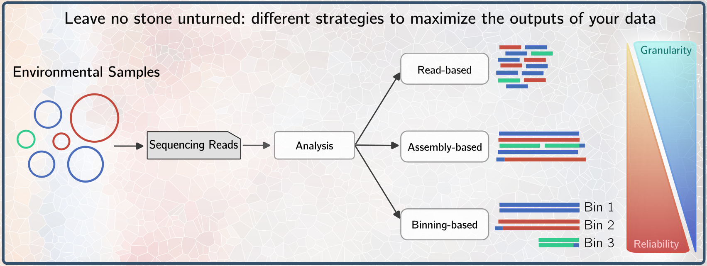

<br> 

Welcome to the documentation of our flexible **metagenomic pipeline** combining biological and geochemical data to outline biosphere and geosphere interactions.

It has been designed to be user friendly and higly customizable, with no bioinformatic expertise required.

Moreover, it has been developed to be easy to integrate with new modules and packages. See our section of [Contributes](contributes/index).

<!-- [Contributes](contributes/) -->




```{toctree}
:caption: Theory
:hidden:

introduction
modules
lastupdates
citation
```

```{toctree}
:caption: Getting started 
:hidden:

installation
update
```

```{toctree}
:caption: Commands
:hidden:

commands/index
commands/setup
commands/workflow
commands/unit
commands/prerun
commands/gather
```

```{toctree}
:caption: Walkthrough
:hidden:

walkthrough/summary
walkthrough/tutorial
```

```{toctree}
:caption: Tips
:hidden:

tips/suggestions
tips/faq
tips/specifictools
```

```{toctree}
:caption: Contributes
:hidden:

contributes/index
contributes/simplepackage
contributes/extdb
contributes/magspackage
contributes/io
```
