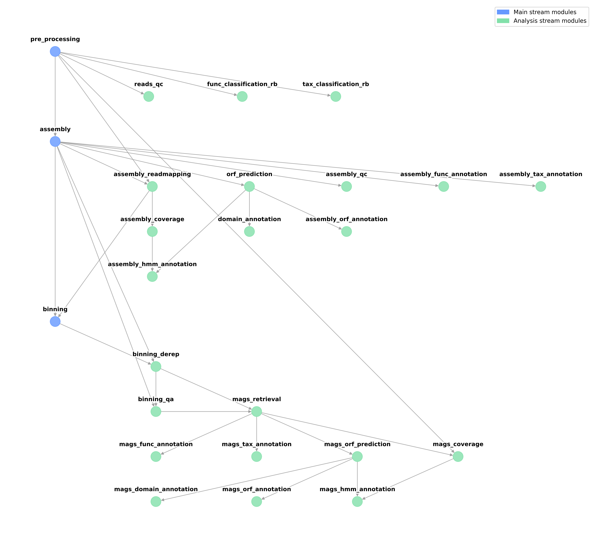

# Introduction

Current metagenomics workflows can exploit three different streams of analysis: read-based, assembly-based, and binning-based. Read-based and/or assembly-based analyses are often neglected in favor of binning-driven inferences on the basis of their different reliability and sensitivity. However, the filtering steps involved in moving from reads to bins progressively reduce the potential amount of information, and thus the meaningfulness of the obtained data. Therefore, there was, the need to create a metagenomic workflow that would combine these three different streams of analysis. Geomosaic was created to meet this purpose. This pipeline allows annotations to be performed on the three streams of analysis, and specially devised for the easy integration of the various programs and packages required. This approach maximizes the output of information gathered from raw data. 
Even so, Gemosaic flexibility allows the user to completely customize the analysis by choosing any stream of analysis, and to further tailor it with modules and packages. Thus, the Geomosaic workflow is sewed for the user purposes.

## Geomosaic Graph Structure

The base graph structure is made up of three main analyses that have to be taken into account when choosing the desired workflow:

| Stream | Module | Depends on |
|-------|------|--------|
| `Read-based`| Pre-processing | - |
| `Assembly-based`| Assembly | Pre-processing |
| `Binning-based`| Binning | Pre-processing, Assembly |

In fact, these dependencies can not be overlooked when generating the workflow with Geomosaic. For instance, ignoring the `Assembly` module hinders the execution of the `Binning` module exactly because of the dependency-based structure.

The full tree of dependencies among all modules is shown here.

## Integrated modules

<!-- https://tablesgenerator.com/html_tables# -->

To summarise, the dependency tree has to be considered when ignoring specific modules, as they may inadvertently block other modules in the current or the next stream of analysis.

<table class="tg"><thead>
  <tr>
    <th class="tg-njus">Stream-level</th>
    <th class="tg-njus">Modules</th>
    <th class="tg-njus">Packages</th>
  </tr></thead>
<tbody>
  <tr>
    <td class="tg-uzvj" rowspan="8">Read-based</td>
    <td class="tg-9wq8" rowspan="3">Pre Processing</td>
    <td class="tg-9wq8">fastp</td>
  </tr>
  <tr>
    <td class="tg-9wq8">trimgalore</td>
  </tr>
  <tr>
    <td class="tg-9wq8">trimmomatic</td>
  </tr>
  <tr>
    <td class="tg-9wq8">Reads Quality Check</td>
    <td class="tg-9wq8">fastqc + reads count</td>
  </tr>
  <tr>
    <td class="tg-9tkk" rowspan="2">Functional Annotation</td>
    <td class="tg-9tkk">ARGs-OAP with Custom DB</td>
  </tr>
  <tr>
    <td class="tg-9wq8">mi-faser</td>
  </tr>
  <tr>
    <td class="tg-9wq8" rowspan="2">Taxonomic Annotation</td>
    <td class="tg-9wq8">Kaiju</td>
  </tr>
  <tr>
    <td class="tg-9wq8">metaPhlAn</td>
  </tr>
  <tr>
    <td class="tg-uzvj" rowspan="16">Assembly Based</td>
    <td class="tg-9wq8" rowspan="2">Assembly</td>
    <td class="tg-9wq8">metaSPAdes</td>
  </tr>
  <tr>
    <td class="tg-9wq8">Megahit</td>
  </tr>
  <tr>
    <td class="tg-9wq8" rowspan="2">Assembly Quality Check</td>
    <td class="tg-9wq8">Quast</td>
  </tr>
  <tr>
    <td class="tg-9wq8">Meta-Quast</td>
  </tr>
  <tr>
    <td class="tg-9wq8" rowspan="4">Read Mapping</td>
    <td class="tg-9wq8">Bowtie2</td>
  </tr>
  <tr>
    <td class="tg-9wq8">Bowtie2 - Output without unmapped reads</td>
  </tr>
  <tr>
    <td class="tg-9wq8">BBMap</td>
  </tr>
  <tr>
    <td class="tg-9wq8">BBMap - Output without unmapped reads</td>
  </tr>
  <tr>
    <td class="tg-9wq8">Read Coverage</td>
    <td class="tg-9wq8">CoverM (contigs)</td>
  </tr>
  <tr>
    <td class="tg-9wq8">Taxonomic Annotation</td>
    <td class="tg-9wq8">Kraken2</td>
  </tr>
  <tr>
    <td class="tg-9wq8">ORF Prediction</td>
    <td class="tg-9wq8">Prodigal</td>
  </tr>
  <tr>
    <td class="tg-9wq8">Domain Annoation</td>
    <td class="tg-9wq8">reCOGnizer</td>
  </tr>
  <tr>
    <td class="tg-9wq8">HMM Annotation</td>
    <td class="tg-9wq8">HMMSearch</td>
  </tr>
  <tr>
    <td class="tg-9wq8" rowspan="2">ORF Annotation</td>
    <td class="tg-9wq8">eggNOG-mapper</td>
  </tr>
  <tr>
    <td class="tg-9wq8">KOfam Scan</td>
  </tr>
  <tr>
    <td class="tg-9wq8">Functional Annotation</td>
    <td class="tg-9wq8">Bakta</td>
  </tr>
  <tr>
    <td class="tg-uzvj" rowspan="12">Binning Based</td>
    <td class="tg-9wq8">Binning</td>
    <td class="tg-9wq8">Multi-Binners (Metabat2 + MaxBin2 + SemiBin2)</td>
  </tr>
  <tr>
    <td class="tg-9wq8">Binning De-replication</td>
    <td class="tg-9wq8">DAS Tool</td>
  </tr>
  <tr>
    <td class="tg-9wq8">Binning Quality Assessment</td>
    <td class="tg-9wq8">CheckM</td>
  </tr>
  <tr>
    <td class="tg-9wq8">MAGs Retrieval</td>
    <td class="tg-9wq8">MAGs Retrieval</td>
  </tr>
  <tr>
    <td class="tg-9wq8" rowspan="2">MAGs Functional Annotation</td>
    <td class="tg-9wq8">DRAM</td>
  </tr>
  <tr>
    <td class="tg-9wq8">Bakta</td>
  </tr>
  <tr>
    <td class="tg-9wq8">MAGs Taxonomic Annotation</td>
    <td class="tg-9wq8">GTDBtk</td>
  </tr>
  <tr>
    <td class="tg-9wq8">MAGs ORF Prediction</td>
    <td class="tg-9wq8">Prodigal</td>
  </tr>
  <tr>
    <td class="tg-9wq8">MAGS Domain Annotation</td>
    <td class="tg-9wq8">reCOGnizer</td>
  </tr>
  <tr>
    <td class="tg-9wq8">MAGs ORF Annotation</td>
    <td class="tg-9wq8">KOfam Scan</td>
  </tr>
  <tr>
    <td class="tg-9wq8">MAGs Coverage</td>
    <td class="tg-9wq8">CoverM (Genome)</td>
  </tr>
  <tr>
    <td class="tg-9wq8">MAGs HMM Annotation</td>
    <td class="tg-9wq8">HMMSearch</td>
  </tr>
</tbody></table>

 

### Modules that could be integrated in future
The following modules are under evaluation for future integration. 

__Read-based__:
- Functional annotation
    - mi-faser (with custom database)

__Assembly-based__:
- Functional Annotation:
    - Prokka
- Taxonomic Annotation
    - cat/bat

However, if you know a module/package you would like to see integrated into Geomosaic, you can open an issue with all the information asking for this integration. At the moment, we accept only packages that can be installed from any Conda channel.
