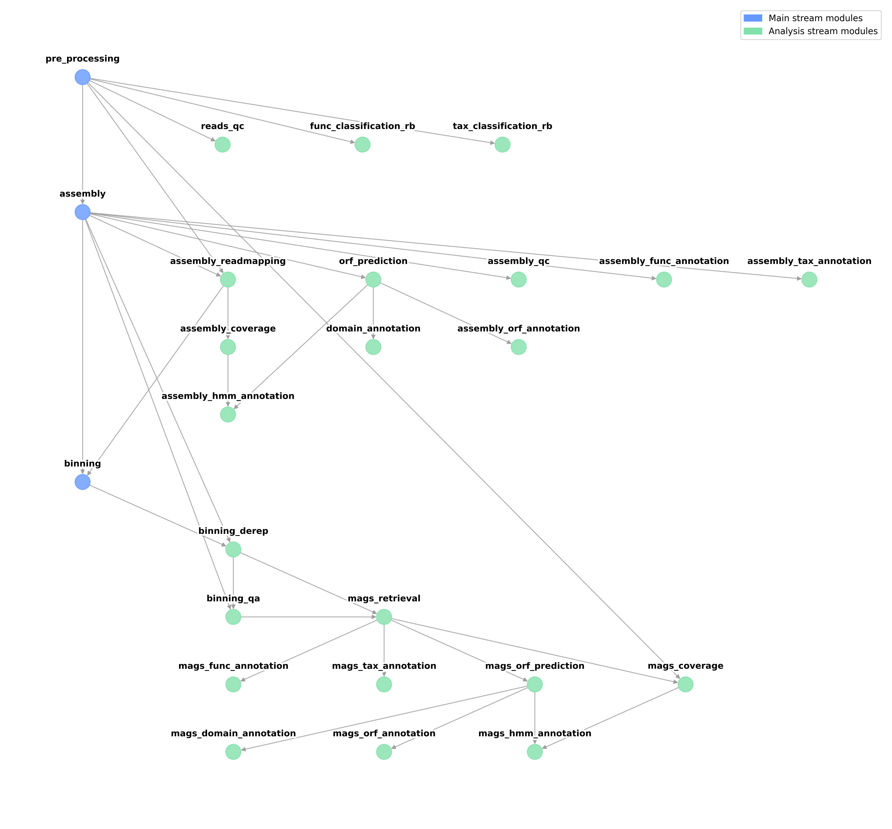

# Modules Dependencies

## Description
Geomosaic is organized as a collection of independent analytical modules connected through a graph-based dependency structure. Each module performs a specific analytical task and can be combined with others to generate workflows ranging from simple read-based analyses to complete genome-resolved metagenomic analyses.

Current metagenomic workflows can exploit three complementary analytical streams: **read-based, assembly-based, and genome-resolved** analyses. Rather than representing different levels of analytical quality, these streams provide complementary biological information at different levels of resolution and genomic context.

Read-based analyses preserve the broadest representation of the sequenced microbial community and are well suited for taxonomic and functional profiling across complete metagenomes. Assembly-based analyses reconstruct longer genomic fragments, enabling gene prediction, functional annotation, and gene neighbourhood analyses while retaining only the fraction of the community that can be successfully assembled. Genome-resolved analyses further associate genes and functions with reconstructed microbial populations through metagenome-assembled genomes (MAGs), providing organism-level genomic context while introducing the additional filtering inherent to assembly, binning, and genome-quality assessment.

Geomosaic was developed to integrate these three analytical representations within a single modular workflow. Users may execute the complete workflow or select only the analytical modules required for their specific scientific question. This modular design maximizes flexibility while maintaining reproducibility and simplifying workflow construction.

At first look, each module may represents a type of analysis that can be performed during the metagenomics workflows. However, this description is useful but not complete as the following

```{admonition} Highlight
:class: important

A **module** is a type of metagenomics analysis that can be performed taking into consideration the dependencies to which it is linked. Therefore, a module will have specific dependencies if the package that implements that type of analysis will take in input the output of the linked modules.
```

Unlike traditional pipelines with fixed execution paths, Geomosaic allows users to execute only the modules required to answer their scientific question.



## Geomosaic Graph Structure

The Geomosaic workflow is built around a Directed Acyclic Graph (DAG), where each node represents an analytical module and edges define dependencies among modules. These dependencies ensure that only valid workflows can be generated while allowing users to customize the analysis by selecting the modules they wish to execute.

The graph is organized around three main analytical streams:

| Stream | Module | Depends on |
|-------|------|--------|
| `Read-based` | Pre-processing | - |
| `Assembly-based` | Assembly | Pre-processing |
| `Genome-resolved` | Binning | Pre-processing, Assembly |

During workflow generation, Geomosaic automatically evaluates these dependencies. For example, if the `Assembly` module is omitted, all downstream modules requiring assembled contigs are automatically excluded from the workflow. This dependency-based approach guarantees workflow consistency while preserving maximum analytical flexibility.

The complete dependency graph for the current release is shown below.


## Input/output dependencies between modules

The definition of dependencies among Geomosaic modules is primarily determined by the type of input required and the type of output produced by the corresponding packages.

For instance, the `assembly_readmapping` module has the goal of mapping sequencing reads against the obtained assembly. Its dependencies are therefore the `pre_processing` and assembly modules, because the analysis requires both the processed reads and the assembled contigs as input. All packages integrated within this module must accept the same type of input and generate the same type of output, in this case SAM/BAM files.

```{note}
It is important that packages integrated within the same module provide compatible output formats. Otherwise, downstream modules may not work consistently across the different software choices available to the user.
```

In this example, any read-mapping package can in principle be integrated into the module as long as it accepts processed reads and the assembly as input and produces the expected outputs. Geomosaic standardizes these outputs as `read_mapping_sorted.bam` and `read_mapping_sorted.bam.bai`.

Another simple example is the assembly module, which represents one of the central steps in many metagenomic workflows. At the time of writing, Geomosaic integrates two packages for this task:

- _MEGAHIT_
- _metaSPAdes_

Both require the processed reads as input and generate assembled contigs as output. Geomosaic standardizes the final assembly output as `geomosaic_contigs.fasta`, obtained after filtering the original assembler output to remove contigs shorter than 1,000 bp. Since both packages use the same input type, the assembly module depends on `pre_processing`.

## What if two packages perform the same type of analysis but require different inputs?

This situation occurred during [integration example 3](contributes/magspackage.md), where KOfam Scan was added for functional annotation of MAGs.

Before this integration, DRAM was the only package performing a related type of analysis. However, the two tools require different inputs. DRAM typically takes as input a directory containing MAG FASTA files, whereas KOfam Scan operates on predicted protein sequences and therefore requires a preceding ORF-prediction step.

Because these input requirements imply different upstream dependencies, the two packages cannot belong to the same Geomosaic module.

For this integration, DRAM was therefore assigned to the `mags_metabolic_function` module, which depends directly on `mags_retrieval`, whereas KOfam Scan was integrated into the `mags_functional_annotation` module, which depends on mags_orf_prediction.

Module names are descriptive labels indicating the general analytical task performed by the packages. The key property defining a module is not its name, but the compatibility of its input requirements, output structure, and dependencies with the rest of the Geomosaic graph.

## Integrated modules

The current Geomosaic release integrates software covering all major stages of metagenomic analysis, from quality control and taxonomic profiling to genome reconstruction and downstream annotation. Modules are organized according to the three complementary analytical streams and can be combined to build workflows adapted to different datasets and research questions.

<!-- https://tablesgenerator.com/html_tables# -->

<style type="text/css">
.tg  {border-collapse:collapse;border-color:#9ABAD9;border-spacing:0;}
.tg td{background-color:#EBF5FF;border-color:#9ABAD9;border-style:solid;border-width:1px;color:#444;
  font-family:Arial, sans-serif;font-size:14px;overflow:hidden;padding:10px 5px;word-break:normal;}
.tg th{background-color:#409cff;border-color:#9ABAD9;border-style:solid;border-width:1px;color:#fff;
  font-family:Arial, sans-serif;font-size:14px;font-weight:normal;overflow:hidden;padding:10px 5px;word-break:normal;}
.tg .tg-9wq8{border-color:inherit;text-align:center;vertical-align:middle}
.tg .tg-9tkk{border-color:#9abad9;text-align:center;vertical-align:middle}
.tg .tg-njus{border-color:inherit;font-weight:bold;position:-webkit-sticky;position:sticky;text-align:center;
  text-decoration:underline;top:-1px;vertical-align:middle;will-change:transform}
.tg .tg-uzvj{border-color:inherit;font-weight:bold;text-align:center;vertical-align:middle}
@media screen and (max-width: 767px) {.tg {width: auto !important;}.tg col {width: auto !important;}.tg-wrap {overflow-x: auto;-webkit-overflow-scrolling: touch;}}</style>
<div class="tg-wrap"><table class="tg"><thead>
  <tr>
    <th class="tg-njus">Stream-level</th>
    <th class="tg-njus">Modules</th>
    <th class="tg-njus">Packages</th>
  </tr></thead>
<tbody>
  <tr>
    <td class="tg-uzvj" rowspan="8">Read-based</td>
    <td class="tg-9wq8" rowspan="3">Pre Processing</td>
    <td class="tg-9wq8">fastp</td>
  </tr>
  <tr>
    <td class="tg-9wq8">trimgalore</td>
  </tr>
  <tr>
    <td class="tg-9wq8">trimmomatic</td>
  </tr>
  <tr>
    <td class="tg-9wq8">Reads Quality Check</td>
    <td class="tg-9wq8">fastqc + reads count</td>
  </tr>
  <tr>
    <td class="tg-9tkk" rowspan="2">Functional Annotation</td>
    <td class="tg-9tkk">ARGs-OAP with Custom DB</td>
  </tr>
  <tr>
    <td class="tg-9wq8">mi-faser</td>
  </tr>
  <tr>
    <td class="tg-9wq8" rowspan="2">Taxonomic Annotation</td>
    <td class="tg-9wq8">Kaiju</td>
  </tr>
  <tr>
    <td class="tg-9wq8">metaPhlAn</td>
  </tr>
  <tr>
    <td class="tg-uzvj" rowspan="16">Assembly Based</td>
    <td class="tg-9wq8" rowspan="2">Assembly</td>
    <td class="tg-9wq8">metaSPAdes</td>
  </tr>
  <tr>
    <td class="tg-9wq8">Megahit</td>
  </tr>
  <tr>
    <td class="tg-9wq8" rowspan="2">Assembly Quality Check</td>
    <td class="tg-9wq8">Quast</td>
  </tr>
  <tr>
    <td class="tg-9wq8">Meta-Quast</td>
  </tr>
  <tr>
    <td class="tg-9wq8" rowspan="4">Read Mapping</td>
    <td class="tg-9wq8">Bowtie2</td>
  </tr>
  <tr>
    <td class="tg-9wq8">Bowtie2 - Output without unmapped reads</td>
  </tr>
  <tr>
    <td class="tg-9wq8">BBMap</td>
  </tr>
  <tr>
    <td class="tg-9wq8">BBMap - Output without unmapped reads</td>
  </tr>
  <tr>
    <td class="tg-9wq8">Read Coverage</td>
    <td class="tg-9wq8">CoverM (contigs)</td>
  </tr>
  <tr>
    <td class="tg-9wq8">Taxonomic Annotation</td>
    <td class="tg-9wq8">Kraken2</td>
  </tr>
  <tr>
    <td class="tg-9wq8">ORF Prediction</td>
    <td class="tg-9wq8">Prodigal</td>
  </tr>
  <tr>
    <td class="tg-9wq8">Domain Annoation</td>
    <td class="tg-9wq8">reCOGnizer</td>
  </tr>
  <tr>
    <td class="tg-9wq8">HMM Annotation</td>
    <td class="tg-9wq8">HMMSearch</td>
  </tr>
  <tr>
    <td class="tg-9wq8" rowspan="2">ORF Annotation</td>
    <td class="tg-9wq8">eggNOG-mapper</td>
  </tr>
  <tr>
    <td class="tg-9wq8">KOfam Scan</td>
  </tr>
  <tr>
    <td class="tg-9wq8">Functional Annotation</td>
    <td class="tg-9wq8">Bakta</td>
  </tr>
  <tr>
    <td class="tg-uzvj" rowspan="12">Binning Based</td>
    <td class="tg-9wq8">Binning</td>
    <td class="tg-9wq8">Multi-Binners (Metabat2 + MaxBin2 + SemiBin2)</td>
  </tr>
  <tr>
    <td class="tg-9wq8">Binning De-replication</td>
    <td class="tg-9wq8">DAS Tool</td>
  </tr>
  <tr>
    <td class="tg-9wq8">Binning Quality Assessment</td>
    <td class="tg-9wq8">CheckM</td>
  </tr>
  <tr>
    <td class="tg-9wq8">MAGs Retrieval</td>
    <td class="tg-9wq8">MAGs Retrieval</td>
  </tr>
  <tr>
    <td class="tg-9wq8" rowspan="2">MAGs Functional Annotation</td>
    <td class="tg-9wq8">DRAM</td>
  </tr>
  <tr>
    <td class="tg-9wq8">Bakta</td>
  </tr>
  <tr>
    <td class="tg-9wq8">MAGs Taxonomic Annotation</td>
    <td class="tg-9wq8">GTDBtk</td>
  </tr>
  <tr>
    <td class="tg-9wq8">MAGs ORF Prediction</td>
    <td class="tg-9wq8">Prodigal</td>
  </tr>
  <tr>
    <td class="tg-9wq8">MAGS Domain Annotation</td>
    <td class="tg-9wq8">reCOGnizer</td>
  </tr>
  <tr>
    <td class="tg-9wq8">MAGs ORF Annotation</td>
    <td class="tg-9wq8">KOfam Scan</td>
  </tr>
  <tr>
    <td class="tg-9wq8">MAGs Coverage</td>
    <td class="tg-9wq8">CoverM (Genome)</td>
  </tr>
  <tr>
    <td class="tg-9wq8">MAGs HMM Annotation</td>
    <td class="tg-9wq8">HMMSearch</td>
  </tr>
</tbody></table></div>


### Future module integration

Geomosaic has been designed as an extensible platform, allowing the straightforward integration of new analytical modules and software packages as they become available.

The following modules are currently under evaluation for future integration.

__Read-based__

- Functional annotation
    - mi-faser (custom database implementation)

__Assembly-based__

- Functional annotation
    - Prokka
- Taxonomic annotation
    - CAT/BAT

Additional tools can be proposed through the GitHub issue tracker. At present, Geomosaic supports the integration of software that can be installed through Conda environments.
