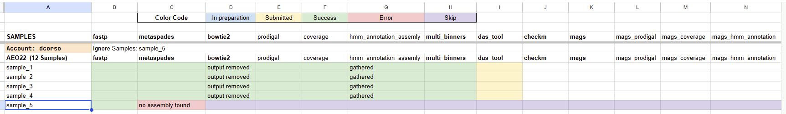

# Suggestions

<br>

In this page you will find some basic suggestions about the Geomosaic execution that may help you. Over time, we plan to update this page based on our experience and the open issues.

<br>

## Create your workflow in two major steps
The issue I will explain here arises only when creating a workflow that includes modules for MAG annotation. 
There are two possible solutions to address this problem:
1. use `geomosaic unit` for each module of your interest
2. divide your `geomosaic workflow` into two major steps

Before going into the details, let me explain this issue. I suggest you read it all and do not skip straightly to the solutions section.

### Issue: No such file or directory: `/path/to/MAGs.tsv`
When you try to create a workflow from scratch to __modules related to the MAGs annotation__ (all the modules after the `mags_retrieval`, for example `mags_orf_prediction`), it happens that you will get an error related to a file called `MAGs.tsv`. Basically, all modules related to the MAGs annotation require a file called `MAGs.tsv`, which however is created by the `mags_retrieval`.

Indeed, before running the workflow, Snakemake tries to check if it has all the expected files to start the computation. However, in the above case, Snakemake is expecting to have a `MAGs.tsv` file, which cannot be found because it is planned to be created within the `mags_retrieval` module (rule named `checkpoint run_mags`).

This is a technical issue that comes from how SnakeMake works, which is not fully compatible with how I need it to work on (possible) multiple MAGs (you can read more about this here: [https://github.com/snakemake/snakemake/issues/2523](https://github.com/snakemake/snakemake/issues/2523)). The solution that I had to implement in Geomosaic is not completely good in this scenario. However, as I said, there are two possible solutions that the user can adapt.

### Solution \#1: use `geomosaic unit` for each module of your interest
The first solution concerns the use of `geomosaic unit` instead of the `geomosaic workflow`, thus executing one module at a time. In this way, Snakemake will only checks the requirements for a single module.

From personal experience, I like using the `geomosaic unit` as it allows me to have more control over each module, check the status of each job, check if it had some errors on some samples, and ignore them in the next steps etc...

For example, this image shows how I’m controlling all the modules while executing the `unit` command since I’m executing one module at a time, and then checking the logs to see if some samples failed. In this case, I can ignore specific samples for future modules in the `geomosaic prerun`. This may be a solution on controlling the modules that you are executing. Keep in mind to do a new `geomosaic prerun` after each unit, specifying the flag `--unit` and also putting a specific folder for the logs. For example, if I’m executing the package `das_tool` (which belongs to the `binning_derep` module), in the prerun command I put the following flag `-f slurm_logs/das_tool`



### Solution \#2: divide your `geomosaic workflow` into two major steps
The second solution is to divide the workflow into two major steps (or two sub-workflows).

1. In the first step, you should execute a `geomosaic workflow` that has all the modules that you want up to the `mags_retrieval` __included__. No more than this. 
2. When all these modules are executed, you can create another `geomosaic workflow` starting from the `mags_retrieval` (using the corresponding flag `--module_start <modulename>`). With this step you can execute all the modules that you want on the Stream Binning-level, such as `mags_orf_prediction`, `mags_tax_annotation` and so on. 

_Why these two steps?_

The first workflow is useful to create the `MAGs.tsv`, so snakemake won't check for its existence for the module like `mags_orf_prediction` (since are not there). Once this workflow is successfully executed, and so the file `MAGs.tsv` is created, the second workflow will try to check the existence of this file, and since it will find it you won't get any error like the one above.

---

## Create a specific log folder for each tool
When executing the `geomosaic prerun`, we suggest putting a specific folder for the tool that we are running or for our workflow. For instance, if we are running the assembly using metaspades with the `geomosaic unit` command, in the prerun you can use `-f slurm_logs/metaspades` to put all the corresponding logs in that folder.

---

## Delete corresponding output folder before re-executing a tool
If you would like to execute a tool again in a specific module, we suggest deleting the previous output folder from sample directories or renaming it. Indeed, snakemake can check if the output does exist, and in this case, it avoids rerunning the computation.

---

## Execute commands with geomosaic conda environment activated
The geomosaic conda environment must be activate __before__ each command, even when submitting jobs through SLURM or executing the workflow using GNU Parallel. 

---

## Execute geomosaic commands in the same folder that contain `gmsetup.yaml`
In the [Walkthrough Tutorial](../walkthrough/tutorial.md#geomosaic-preparation-for-different-datasets) you can see that each command was executed in the same folder where the `gmsetup.yaml` was. We proposed this organization to work inside the root folder of the geomosaic computation of your dataset.

---

## Multiple users belonging to one group in Linux. How to handle shared data.
Often HPC cluster admins creates users that may belong to certain group, in order to let them have write/read permissions in a specific folder that may belong to the user's of your group.
If you would like to use Geomosaic for multiple datasets, you can start reading about the folder organization that we have proposed on our [Walkthrough Tutorial](../walkthrough/tutorial.md#macro-organization-of-the-folders). Moreover, the optimal scenario would be the possibility to use the already installed conda environments or already download external databases. For this purpose, we suggest to change the permission of the corresponding folders where conda environments are installed and external databases were downloaded. 

As group, we used Geomosaic on our data with a scenario like this, where a master folder called `GiovannelliLab` was created, where we were able to use different accounts, each one with permission to write and reads on that folder. Thus, in order to use conda environments and external databases that we already set up, we changed the corresponding folders permission with 

```
cd GiovannelliLab/utils/

chmod -R g+rwx geomosaic_condaenvs

chmod -R g+rwx geomosaic_extdb

```

### Install all the conda environments and download all the external databases before executing any workflow
Specifically, to allows multiple users having access to these folders, we suggest to install all the conda environments and download all the databases __before__ executing any command. This may be useful to prevent multiple users writing on the same folder, each one installing a conda environment and then retrieve which account you need to change permission of the installed conda env.

Basically, we used one account to install all the conda environments of the packages to which we were interested and download all the corresponding external dabatases. Thus we have created a workflow with these tools, and with the same account we executed first the `prerun` command (to install the conda envs) and then we run the `Snakefile_extdb.smk` file (using SLURM, to download all the extdb).

After all these steps were completed, we used the commands above to change the directory permissions

```
chmod -R g+rwx geomosaic_condaenvs

chmod -R g+rwx geomosaic_extdb
```

Following these steps we were able to use Geomosaic with different account, each referring its computation the same `geomosaic_condaenvs` and `geomosaic_extdb` without any error.

### Installing conda envs and extdb with different accounts
It may happen that one user may install a conda env (or download an extdb) that didn't exists before. In this scenario, after the execution of the `prerun` command we suggest to perform the above command to change permission in the corresponding installed conda envs (or download extdb).

---

## __[For Expert Users]__ Execution types of the workflow
To execute the created workflow, you can use the `prerun` command to create scripts for SLURM or GNU Parallel. When available we always suggest to use `--exec_type slurm` with the prerun. 

However, since the workflow is a Snakefile, if you are familiar with [Snakemake](https://snakemake.github.io) you can also use it to run the workflow. You will need to specify the following flags

- `--use-conda`
- `--conda-prefix <path to the geomosaic conda envs folder>` 

You can always refer to our [geomsoaic templates](https://github.com/giovannellilab/Geomosaic/blob/master/src/geomosaic/_slurm_templates.py)

Moreover, Snakemake has its own tutorial to execute the workflow using [SLURM](https://snakemake.readthedocs.io/en/stable/executing/cli.html#profiles).

