# Tutorial

<br>

Welcome to our Walkthrough tutorial of Geomosaic! The idea behind this section is to provide you a complete guideline on how to organize your working directory to execute Geomosaic.
We will provide some suggestions, tips and description explaining why we organize all things in a given way. However, these guidelines may not be suitable for your purpose. Hence, feel free to contact us for any suggestion or comment!

<br>

## Macro-organization of the folders

To perform a suitable computation on our clusters, we should have proper organization of our folder. Here we propose a way to organize folders that was useful for our computations. It is based on the usage of one master folder, for instance `gm_walkthrough`.

> 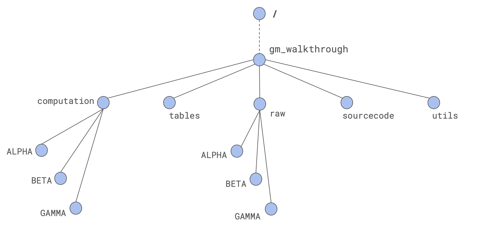

The adopted strategy involves the following folders:
- (`raw`) contains the raw sequencing reads 
- (`tables`) contains the table that we need to give as an input to the `geomosaic setup` command
- (`utils`) that we think is going to contain some data that may be shared between different executions of geomosaic on different datasets
- (`sourcecode`)  in which we are going to download the sources of Geomosaic from the github repository
- (`computation`) in which we are going to execute geomosaic for different datasets

Here we show how things were created in the terminal
> 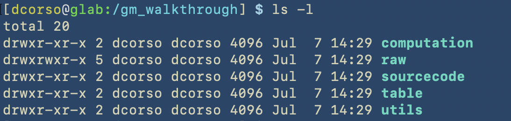

Here we show the content of the correspoding folders
> 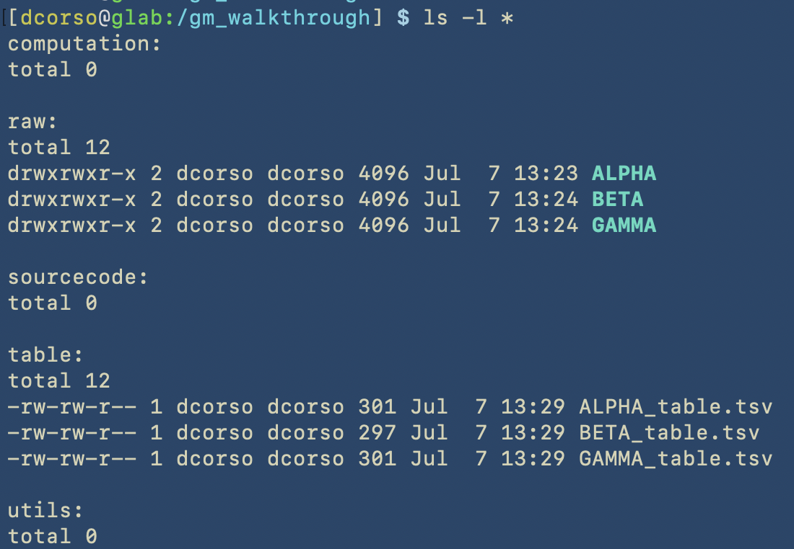


As we can see, the following folders `computation`, `sourcecode` and `utils` are empty as we still have to start with geomosaic commands. However, `raw` folder contains raw reads for three different datasets: `ALPHA`, `BETA`, `GAMMA`.

> 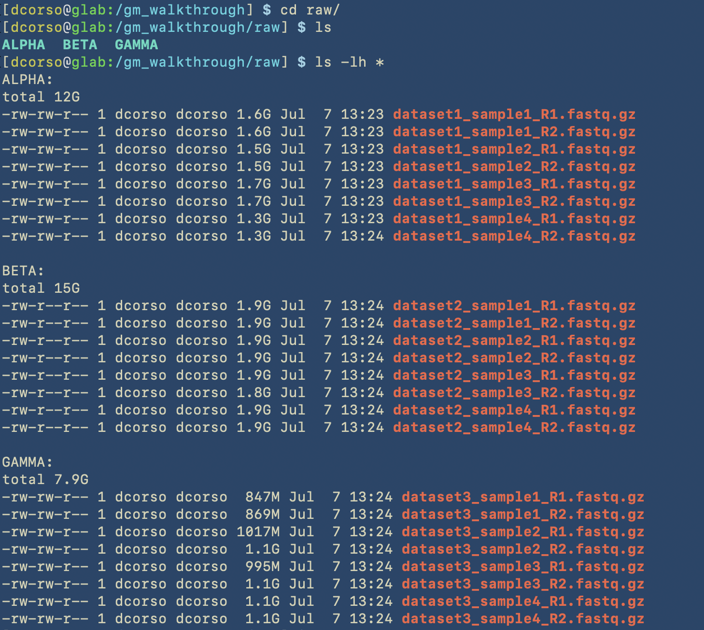
 
The `tables` directory already contains the corresponding files that we will give as input to the `setup` command. Here the content of one of these is shown, as it can be viewed with the `less` command

> 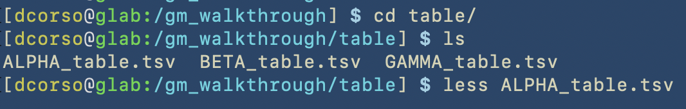

This is the content of the table, which is a TSV (Tab Separated Value) file. As already described, we provide the actual filename for the forward and reverse reads in the `r1` and `r2` columns, respectively, and the corresponding sample name in the `sample` column.
> 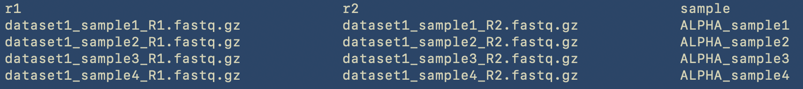

## Installation of Geomosaic
The next step is to download and install geomosaic from the github repository. First, we perform a `git clone` on the `sourcecode` folder and then we create the conda environment using the provided file. We highly suggest you to use `mamba` instead of `conda` as it is much faster!!!
> 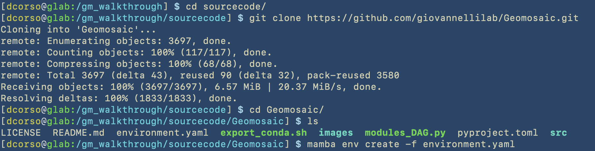

After the execution of `mamba env create -f environment.yaml` we should be able to see the `geomosaic` conda environment installed by using the command `mamba env list`.
> 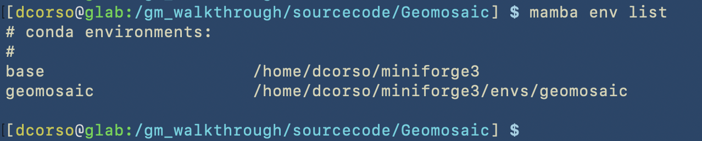

Now we activate the geomosaic environment.
> 

```{important}
You should always have the `geomosaic` conda environment activated before running all the commands, even when submitting jobs with `sbatch` for SLURM. You can see this detail in the next images.
```

We can see the environment activated as a small section appearing in our terminal prompt.
Something like this: 
```
(geomosaic) [dcorso@glab:/gm_walkthrough/sourcecode/Geomosaic] $ 
```

in our case this section appears before the `$`
> 

Now we can install the python libraries by executing 
```
pip install .
```

This is the start of the execution
> 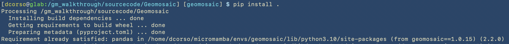

This is the end of the installation
> 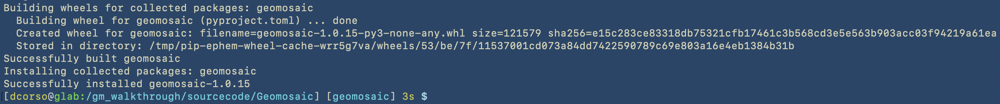

Now we are ready to go!

## Geomosaic preparation for different datasets
It is highly suggested to have a folder for each dataset, even in the `computation` directory. In this way, we can easily recognize the geomosaic computation for each dataset.
In this case, we can create `ALPHA`, `BETA` and `GAMMA`.

> 

And let's start with Geomosaic for the `ALPHA` dataset.

## Geomosaic SETUP - Command
We suggest to visualise all the options available for each command by executing the `--help` or `-h` flag. At the time of writing of this tutorial, we have the following options, divided in `Required` and `Optional`.
 
> 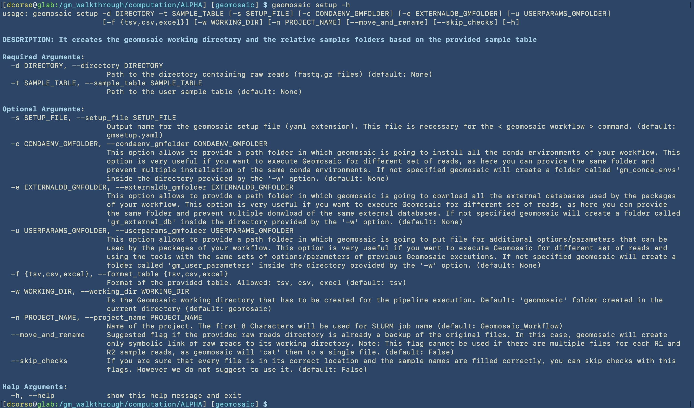

As we can see from the next image, for this example, we are going to use the following options:
- two __mandatory__ flags:
  - `-t` to specify the table file
  - `-d` to specify the folder that contains all the reads
- four __optional__ flags:
  - `-c` to specify the folder in which geomosaic is going to install all the conda environments for all the packages that we are going to choose. It is very useful to specify this path, as we plan to execute geomosaic for different datasets, and in this way we can avoid multiple installations of the same packages. Indeed, in the next geomosaic computation we can refer to this path for the `-c` option. If the folder does not exists (like in this case), geomosaic will create it.
  - `-e` likewise, to avoid multiple downloads of the same external databases, we can specify this path. Indeed, in the next geomosaic computation we can refer to this path for the `-e` options. If the folder does not exists, geomosaic will create it.
    > 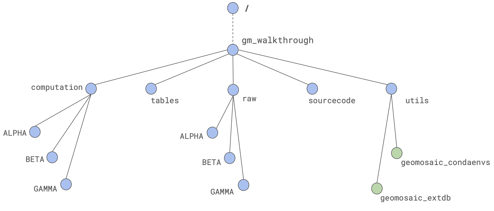
  - `-n` to specify a title for our execution.

    ```{note}
    The first 8 characters in this options will be used for the job names in SLURM specification.
    ```
  
  - `--move_and_rename` to avoid duplication of the reads in the storage, we use this flag to move and rename the forward and reverse reads (for each sample) as `R1.fastq.gz` and `R2.fastq.gz`, respectively.

> 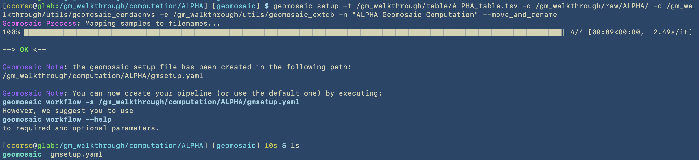

As we can see, geomosaic will describe all the process and the output of this command, which are:
- `gmsetup.yaml` a configuration file for geomosaic containing some basic information
    > 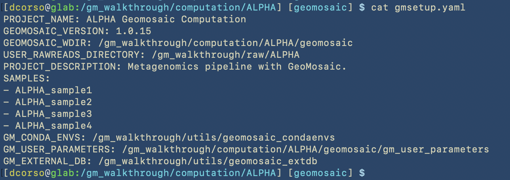
- `geomosaic`, which is the working directory continaing one folder for each sample
    > 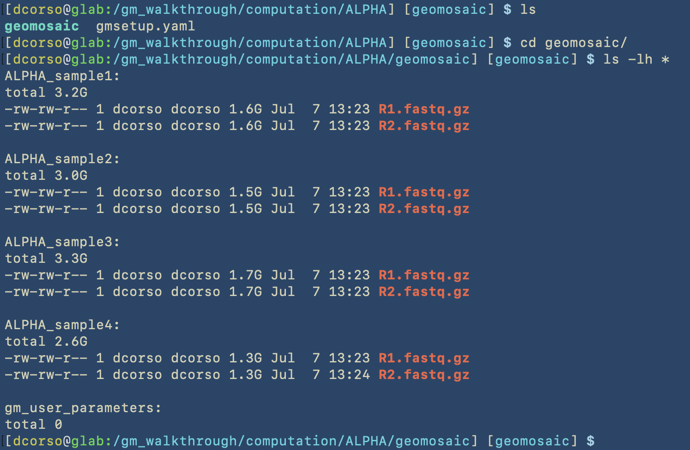

Now that we have executed the setup, we can move forward to the customization of the workflow!!

## Geomosaic WORKFLOW - Command
We always suggest to visualise all the flags before executing the command.
> 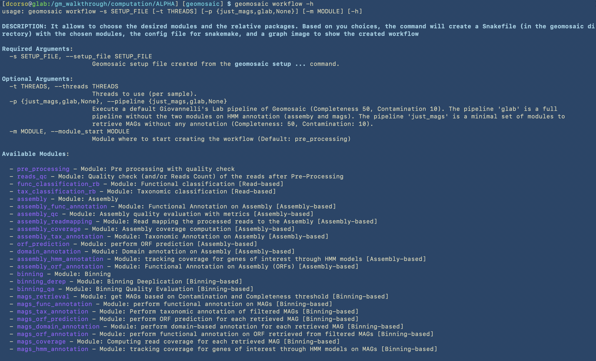

This step is very straightfoward. Since we don't want to use pre-computed workflows and we would like to start from the the `pre_processing` module, we are __not__ going to use the following options: `--module_start` and `--pipeline`.
However, we may already know how many CPUs we would like to use for each sample computation, so in this case we can specify this parameter by using the `-t` option.

```{admonition} Highlight
:class: important

In order to properly choose the workflow and avoid skipping modules that may automatically disable following analysis, we suggest to always follow the basic graph structure of Geomosaic.
```

> 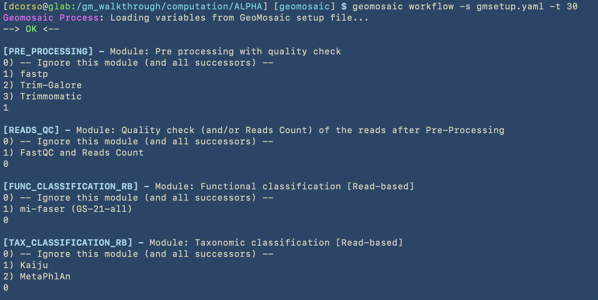

As we can see, Geomosaic will start asking questions about the modules that we would like to run. For each, we can see a (numbered) list of available tools, and by typing the corresponding integer number we can choose whether to skip or use one of the available tools. In this case we did skip all the Read-based annotations.

In the next image we can see all the choices for the modules belonging to the Assembly-based analysis.
> 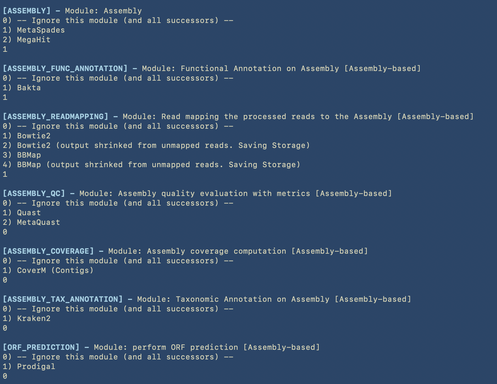

In the next image we can see all the choices for the modules belonging to the Binning-based analysis.
> 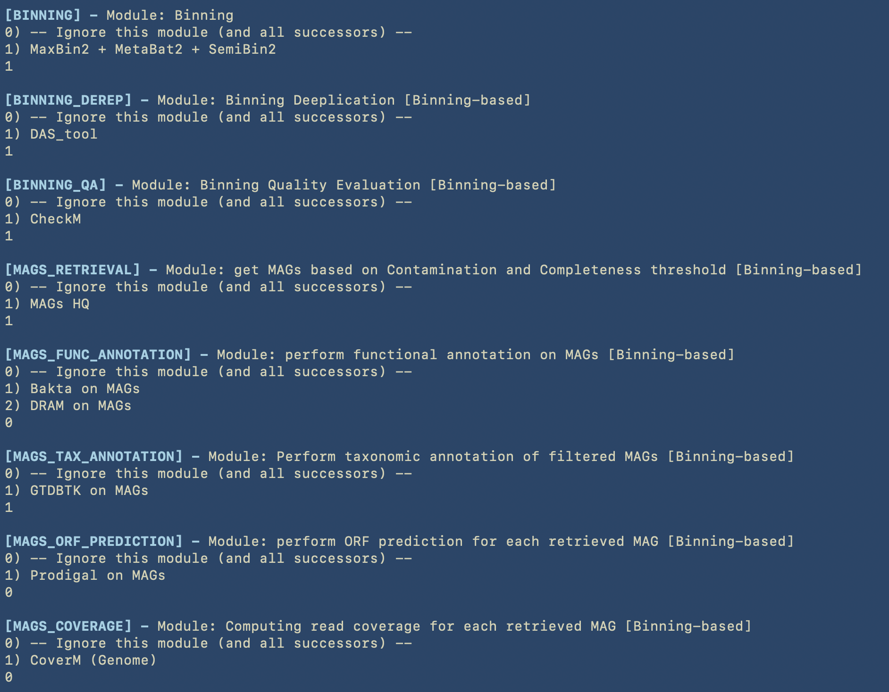

The last part of this command is dedicated to the _Additional Parameters_. Since we decided to retrieve the MAGs, Geomosaic will ask for the threasholds concerning the __completeness__ and __contamination__ values.

> 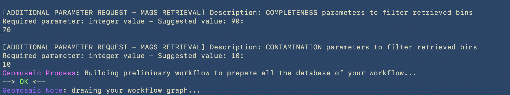

After this command we should see:
> 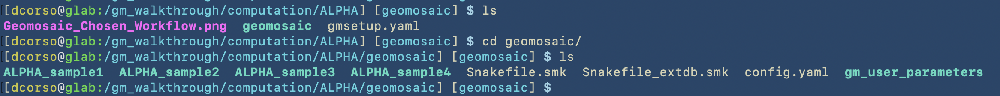

- `Geomosaic_Chosen_Workflow.png`: the graph colored according to our choices on the modules
  > 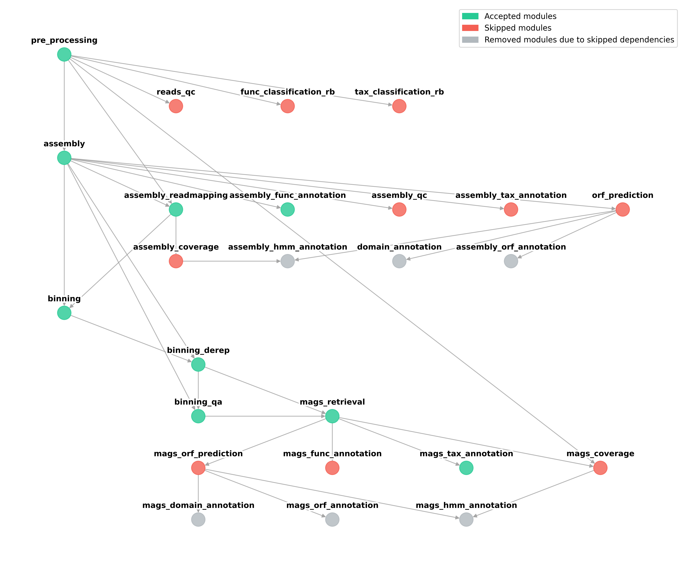
- (inside the geomosaic working directory): the script `Snakefile.smk` with the corresponding `config.yaml`. 
  > 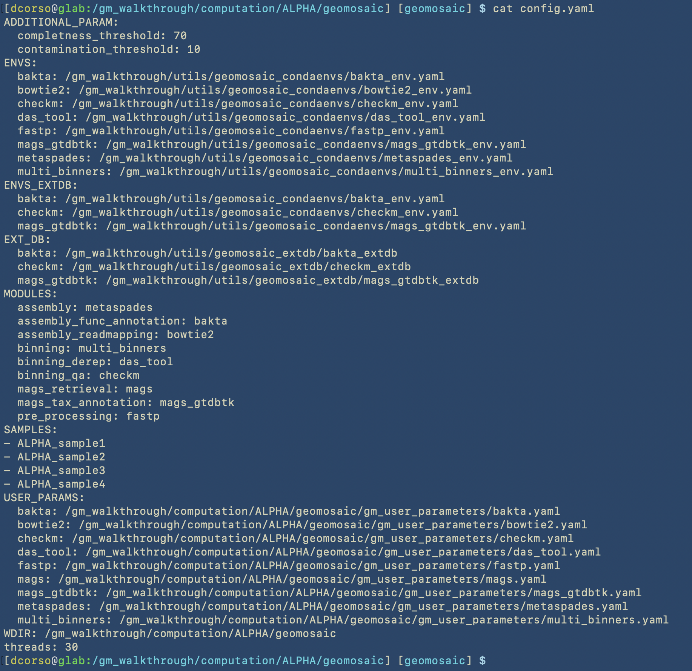

Moreover, based on our choices, we should see (like in this example) the script `Snakefile_extdb.smk` which contains all the code to download external databases for the packages. __This latter script should be the first one to execute.__

Now that we have created the workflow, we can move forward to the next step.

## Geomosaic PRERUN - Command
For this command we should have two goals:
- create the script to execute the workflow on HPC using Slurm or GNU Parallel
- install the corresponding conda environments for the packages that we have chosen

Let's open the help section also for this command.
> 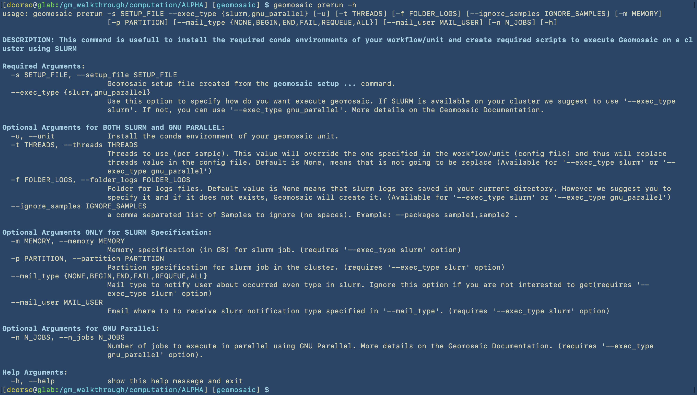

For this command we are going to use the following options:
- two __mandatory__ flags:
  - `-s` to give the `gmsetup.yaml` as input
  - `--exec_type` to specify the type of execution. In this case we are going to use `slurm`
- three __optional__ flags:

  ```{important}
  Despite the following flags are considered optional, we highly suggest to use at least these three as they may be enough for a minimum good slurm specification of your jobs.
  ```

  - `-f` to specify the folder in which geomosaic is going to put all the slurm logs. In this case we are going to specify two nested folders, and if they don't exists, geomosaic will create them.
  - `-m` to specify the memory resource in slurm. The specification is in GigaByte. So in this case we ask for 500Gb of memory for each sample execution.
  - `-p` to specify the partition on the HPC in which we are going to submit the jobs.

    ```{warning}
    __Concerning Partitions__ <br>
    It is very common that HPC cluster admins create different partitions, so you need to be _aware_ of which one you should use. This is something that we can not solve.
    ```

In this image we can see the first part of the process of the `prerun` command, which concerns the creation of the SLURM scripts.
> 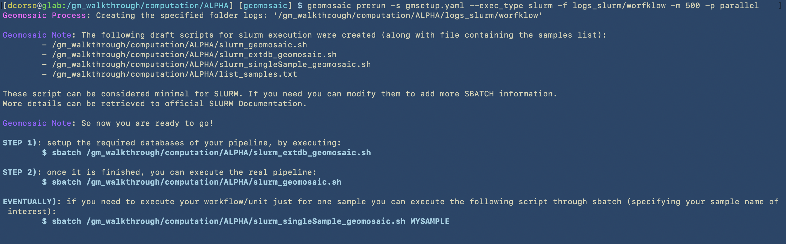

In this image we can see the second part, in which the `prerun` starts to install the conda environments in the path that we have specified in the `setup` command by using the `-c` option.
> 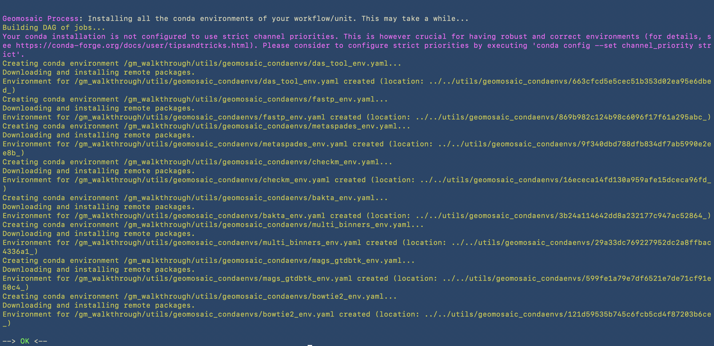

<br>

As described in the first part of the prerun, the output of this command are the following files:

- `/gm_walkthrough/computation/ALPHA/slurm_geomosaic.sh`, which contains all the slurm specification to submit an array of jobs for all the samples that we have, each one with the corresponding resources: 500Gb of Memory and 30 CPUs. Here we can see the content of this script.
    > 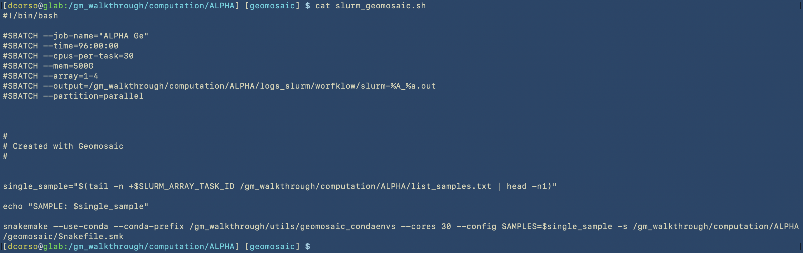
- `/gm_walkthrough/computation/ALPHA/slurm_extdb_geomosaic.sh`, which contains all the slurm specification to submit the job that allows to download the external databases. Here we can see the content of this script.
    > 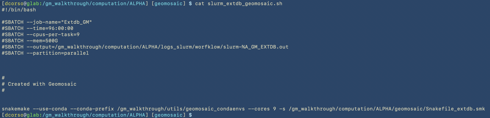
- `/gm_walkthrough/computation/ALPHA/slurm_singleSample_geomosaic.sh`, which basically contains almost the same content of the `slurm_geomosaic.sh`. However, `slurm_singleSample_geomosaic.sh` script takes one sample name as input (as first parameter). This script is useful if we want to execute the workflow for just one sample at the time.
- `/gm_walkthrough/computation/ALPHA/list_samples.txt`, which contains the list of the samples that we have.
    > 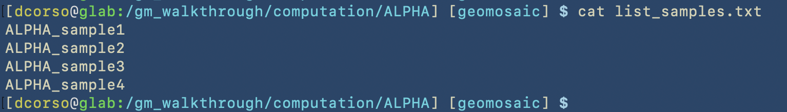

<br>

Since our workflow required the download external databases, the first script that we should execute is the `slurm_extdb_geomosaic.sh`.

```{important}
Keep in mind that the specified folder for the download of external databases can be re-used for the next computation of Geomosaic. So, once we have downloaded what we need, we can refer to this folder to avoid duplicate files.
```

Let's submit the job for the external database
> 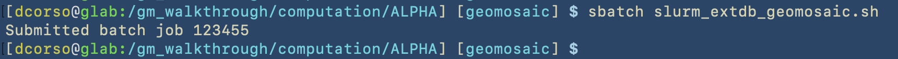

Once this job is finished, we can submit the actual jobs to execute the workflow for each sample

> 

## Geomosaic GATHER - Command
This part is optional, however it is very useful if we want to gather the results for specific packages to create plots or data for downstream analysis.

Lets see which parameters this command requires
> 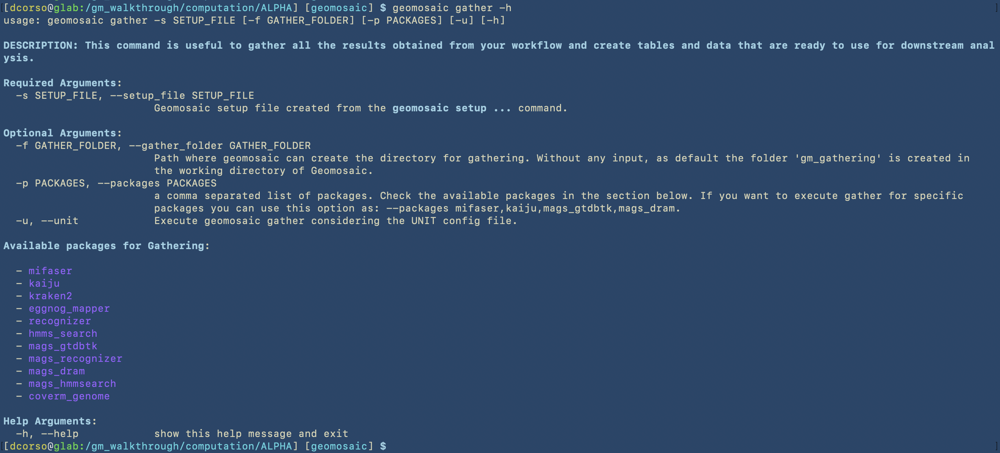

Let's assume that we want to use this command only for the results of `mags_gtdbtk`. In the following image we can see the command that we use and the folder that it created.
> 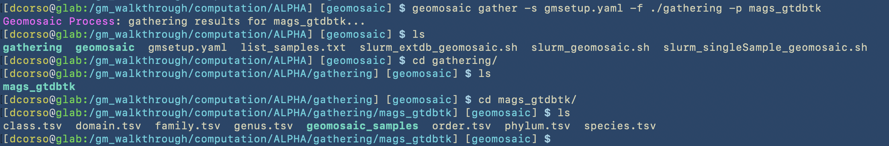

By using `geomosaic gather`, we put together all the results from different samples. 
By using `less` we can see the content of the phylum table.

```
less phylum.tsv
```
> 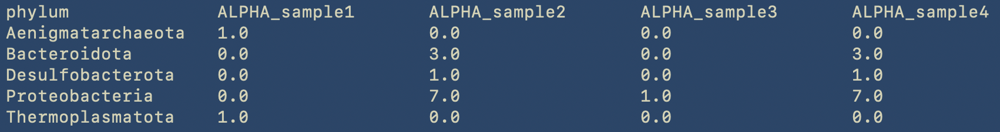


## Geomosaic SETUP - with second dataset

The idea of this organization was to make it easier to run Geomosaic for further datasets. As we described during the tutorial, we can re-use the path specified for the conda environments and for the external databases. 
This part of the tutorial is useful to show that we can refer to those paths in the `setup` command for another dataset.

> 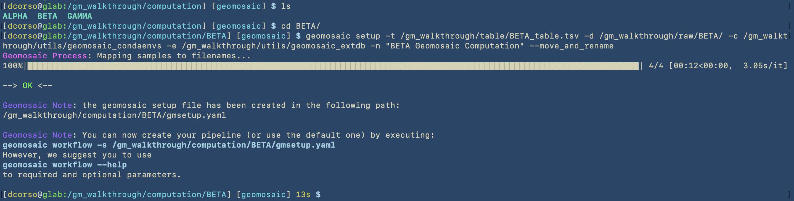

In the previous case, the `-c` and `-e` options were the same as the previous dataset.

The next two images will show that Geomosaic can recognize already existing conda environments for packages. To briefly show this case, we used the `unit` command to choose `fastp` (that was already chosen in the workflow of the ALPHA dataset); then, the prerun will not re-install it as it is already present.

`geomosaic unit`
> 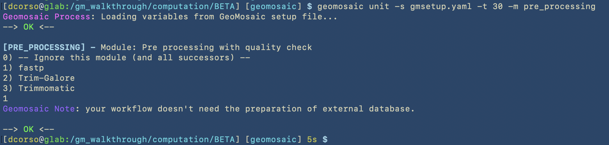

`geomosaic prerun`
> 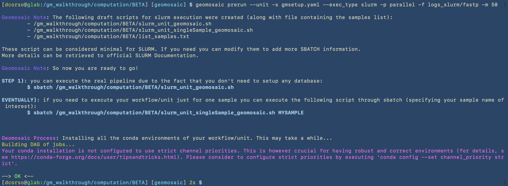

Lastly, we show the `geomosaic_condaenvs` folder containing all the installed environments. This installation step is executed by Snakemake and we cannot decide the name of the envrionments, even if we specified that in each env file.

> 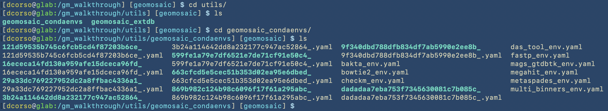

